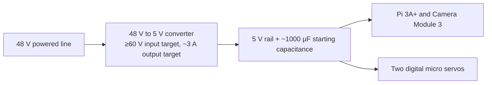

# Camera pod

## Responsibility and boundary

The camera pod is the only substantial moving assembly. It owns the four-line cable spider, fixed compute and power-electronics mounts, two-axis gimbal, camera, pod harness, optical/rain protection, docking stud, pod-side strain relief, pod software, mass properties, thermal behavior, and health reporting.

The [positioning lines](../positioning-lines/README.md) own the lines and their tensile/electrical construction. The [dock](../dock/README.md) owns the receiving funnel, latch, shelter, and parked-state sensor.

## V1 mass budget

| Component | Repository estimate | Notes |
| --- | ---: | --- |
| Raspberry Pi 3A+ | Approximately 29 g | Fixed to pod |
| Camera Module 3 Standard | Approximately 4 g | Moves with gimbal |
| 48 V to 5 V, approximately 3 A converter | Module-dependent | Fixed; at least 60 V input rating target |
| Approximately 1000 µF bulk capacitor | Module-dependent | Fixed near 5 V distribution |
| 2 × approximately 3.7 g digital servos | Approximately 7.4 g total | Moving gimbal actuators |
| Gimbal, horns, short wiring, and fasteners | Approximately 9–13 g | Moving mechanism |
| Pan/tilt addition subtotal | Approximately 16–20 g | Servos plus gimbal hardware |
| Printed spider/chassis | Approximately 15–25 g target | Fixed structural chassis |
| Short CSI ribbon, power wiring, and strain relief | Approximately 5–10 g | Interconnect |
| Rain cap and optical protection | Approximately 5–10 g target | Splash/direct-rain mitigation |
| Complete flying pod | **100–120 g target; approximately 170 g hard design ceiling** | Must be measured as assembled |

The 170 g value is a ceiling, not a target. CAD mass estimates do not replace weighing the complete configured assembly.

## Mechanical arrangement

The cable spider is the primary chassis. Keep the Raspberry Pi 3A+, converter, and capacitor fixed to the spider so only Camera Module 3 and the light gimbal move. This reduces servo load, moving inertia, ribbon movement, and settling time.

The design must define:

- line-attachment geometry and independent tensile terminations;
- center of gravity and its relationship to line plane and docking stud;
- docking stud above the center of gravity for pendulum-stable approach;
- fixed mounts, airflow, drainage, and service access;
- gimbal bearings/pivots, hard stops, horn attachment, backlash, and collision envelope;
- CSI ribbon bend radius and strain relief through the full gimbal range;
- secondary retention where a single small fastener could release a heavier part;
- safe optical opening and no water path into electronics.

## Gimbal and camera

V1 uses Raspberry Pi Camera Module 3 Standard, the normal-field-of-view autofocus version. The baseline range is:

- pan: approximately ±90 degrees from its reference direction;
- tilt: 0 degrees straight down to approximately 70 degrees toward sideways.

Software limits must stop before the ribbon, cap, servo, camera board, or chassis binds. Hard geometry must also prevent a software error from tearing the ribbon or driving the mechanism into a damaging configuration.

The same camera is intended for whole-bed overviews, downward plant images, and selected oblique close-ups. Skycam X/Y positioning moves above the target first; gimbal motion refines framing after the pod stops. Future lower-Z close-ups are allowed only inside a separately validated crop and line-clearance envelope.

A 360-degree camera is excluded from V1 because most pixels would cover irrelevant directions and its mass is higher. A future higher-resolution autofocus module is a compatible design question, not part of V1.

## Pod power and electronics

The repository baseline feeds nominal 48 V through the powered positioning line and converts locally to 5 V:

The converter input/output ratings and capacitance are **starting targets**. Validate supply transients, input surge, maximum line voltage, voltage drop, current, efficiency, heat, brownout margin, servo stall/fault, Pi/camera capture load, Wi-Fi load, grounding, fusing, connectors, and capacitor temperature/ripple/lifetime.

The pod has no battery. It must start, stop, and recover deterministically when powered-line voltage is interrupted or marginal.

## Printed parts and fasteners

Expected custom models include:

- cable spider/chassis;
- Pi and power-electronics mount;
- lightweight pan/tilt gimbal;
- servo-body rain cap;
- optical hood/protection;
- hybrid-line strain relief;
- docking stud mount.

ASA is preferred for exposed release parts. PETG is acceptable for prototypes pending creep and weather evidence. Each OpenSCAD model needs a stable part ID/revision, interface dimensions, material and print specification, expected mass, and test evidence. Small servo screws, horns, inserts, pivots, and camera fasteners must be documented with the same care as larger parts.

## Weather and environmental behavior

The micro servos are not waterproof. The cap only reduces direct rain and splash; it does not authorize wet-weather operation. Wiring must not channel water into a servo case, camera connector, or electronics. Drainage, condensation, UV, temperature, insects, fertilizer/chemical exposure, and contamination of the optical opening require evaluation.

The pod normally returns to the sheltered high dock after each job. See [weather, parking, and maintenance](../../operations/weather-parking-and-maintenance.md).

## Pod software

The pod service is expected to:

- initialize the camera and servos;
- expose health, revision, supply, temperature, and fault information available on the selected hardware;
- enforce calibrated software angle limits;
- move to requested pan/tilt position;
- wait the commanded settling interval;
- autofocus only after settling;
- optionally capture a low-resolution preview/check;
- capture the full-resolution still;
- transfer the image over Wi-Fi;
- reject stale, incompatible, unsafe, or duplicate commands according to the versioned protocol.

The current settling range is approximately 100–300 ms. Measure it for representative moves and increase it when required; do not bake the range in as demonstrated truth.

## Imaging sequence

1. Skycam moves to the coarse target while the gimbal remains in its safe motion pose.
2. Skycam motion stops.
3. Gimbal moves to calibrated framing.
4. The pod waits the measured settling interval.
5. Camera autofocus runs.
6. The pod captures and reports the image and metadata.

Do not reposition the gimbal during a normal Skycam move.

## Acceptance evidence

- Complete configured mass at or below the accepted limit, with center-of-gravity and balance record.
- Static and cyclic evidence for spider, line attachments, docking stud, mounts, pivots, fasteners, and strain relief.
- Stable 5 V rail during worst expected line extension, servo motion, capture, and Wi-Fi transfer.
- Converter/capacitor/electronics thermal results inside docked and operating environmental envelopes.
- Gimbal range, hard/software limits, ribbon clearance, backlash, repeatability, and measured settling time.
- Repeatable focus and framing across representative bed/plant positions and light conditions.
- Controlled power interruption, service restart, communication loss, and partial-command behavior.
- Rain/splash, drainage, condensation, UV/material, and dock-shelter checks without claiming waterproofing.

## Open questions

- Exact servo, converter, capacitor, connector, and wiring choices.
- Final mass budget and whether an IMU adds enough value to justify its mass and complexity.
- Final pan/tilt geometry, optical hood, rain cap, and CSI routing.
- Required lighting after daylight-only image trials.
- Pod privacy indicators, local image retention, update security, and credential storage.
- Whether any heavier part needs an independent secondary tether compatible with imaging and docking.
