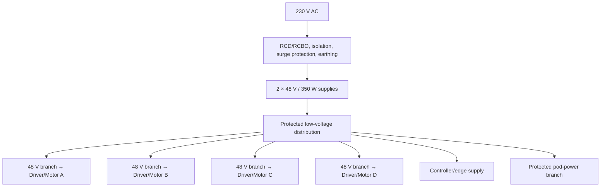

# Control cabinet

## Responsibility and boundary

The fixed control cabinet owns mains entry, isolation, electrical protection, earthing/bonding, two 48 V power supplies, protected low-voltage distribution, controller power, the Pico 2 W motion controller and terminal board, terminal schedules, control-signal origin, future edge-compute accommodation, enclosure environment, labeling, and service isolation.

The four CL57Y-V20 motor drivers remain near their pole-mounted motors because the baseline matched motor/encoder cables are approximately 2 m. The cabinet owns each outgoing branch up to the defined field interface; the endpoint assembly owns its local enclosure and internal wiring.

## Electrical baseline

The two supplies are included in the selected four-axis motor kit according to the repository baseline. Their exact revision, output sharing/allocation, protection, fault behavior, installation instructions, and suitability must be verified.

Mains remains in the fixed cabinet. That boundary does not by itself prove electrical safety. The complete outdoor installation needs qualified design, installation, inspection, and test evidence for applicable requirements.

## Motion controller baseline

V1 selects a Raspberry Pi Pico 2 W with pre-soldered headers plugged into a 52Pi EP-0145 screw-terminal expansion board. The intent is solderless, inspectable field termination for the controller.

The CL57Y-V20 V2.0 baseline uses 3.3 V STEP/DIR control rather than RS485/Modbus. The current design therefore omits AM26C31, MAX490, RS422 converters, and a custom level-shifter PCB.

| Axis | STEP | DIR |
| --- | --- | --- |
| A | GP2 | GP3 |
| B | GP4 | GP5 |
| C | GP6 | GP7 |
| D | GP8 | GP9 |

Direct 3.3 V single-ended signaling over long outdoor runs is **unverified**. Bench and installed testing must cover voltage thresholds, cable length, edge rate, shared ground, common-mode disturbance, motor noise, surge/transient exposure, false steps, and fault behavior. Differential conversion remains an option if evidence requires it.

## Field wiring baseline

Each pole needs:

- separately protected 48 V and return;
- one outdoor Cat5e STEP/DIR control cable;
- local home/reference connection as designed;
- short driver-to-motor and encoder cables supplied/matched to the kit.

The V1 pair assignment is:

- orange/orange-white: STEP and dedicated ground return;
- green/green-white: DIR and dedicated ground return;
- blue pair: reserved for ENABLE or ALARM;
- brown pair: spare/future.

A DIN-rail ground distribution block is proposed so each signal pair has a dedicated return while sharing controller ground. A reviewed terminal schedule must supersede prose before construction.

The field design must define cable/conductor part, length, current, voltage drop, fuse/protection, entry gland, shielding or separation, grounding/bonding, labeling, connector/terminal, service loop, routing, environmental rating, and endpoint. Do not parallel power-supply outputs or contacts unless the manufacturer and reviewed design allow it.

## Cabinet mechanics and environment

The enclosure design must address:

- ingress rating and protected cable entries;
- condensation, drainage, sun/temperature, ventilation, and insects;
- separation of mains, 48 V power, and low-level control;
- DIN-rail layout, touch protection, conductor bend radius, and service access;
- rated isolation and lockout;
- labels, schematics, warnings, branch IDs, and revision plate;
- fire behavior and safe mounting surface;
- surge/lightning exposure from long outdoor conductors;
- spare space and thermal budget for edge compute/network equipment;
- no loss of protection when doors or service covers are opened.

## Edge service boundary

The architecture depends on a local edge service, but its hardware, OS, networking, storage, and cabinet integration are not selected. It is expected to:

- map bed/plant targets to physical position and framing presets;
- queue and sequence local motion/capture jobs;
- communicate with the Pico and pod;
- enforce docking, weather, safety, and maintenance policy;
- cache captures during Internet outages;
- upload images and health when connectivity returns;
- record diagnostics and telemetry.

The motion and safety system must remain locally effective if the edge application, network, or cloud fails.

## Firmware and safety controls

The Pico firmware should generate synchronized trajectories, apply local workspace/configuration limits, handle home/reference and driver signals, and expose deterministic command/telemetry behavior. A normal application heartbeat is not a substitute for independent limits or emergency isolation.

The cabinet design must establish:

- safe startup and outputs after reset/brownout;
- watchdog behavior;
- driver enable/alarm wiring;
- emergency isolation and stop categories appropriate to the risk analysis;
- branch isolation for service;
- controller and edge update/recovery behavior;
- configuration identity and compatibility checks;
- event/telemetry persistence sufficient for incident investigation.

## Acceptance evidence

- Qualified schematic, protection, conductor, earthing/bonding, segregation, enclosure, surge, thermal, and installation review.
- As-built schematic and terminal schedule matching physical labels.
- Electrical inspection/test records and branch fault/isolation tests.
- Worst-duty power and thermal measurements with the final enclosure and environment.
- Controller reset, brownout, watchdog, communication-loss, driver-alarm, home/limit, and emergency-isolation behavior.
- End-to-end STEP/DIR signal integrity with motors operating and realistic field cable lengths.
- Pod branch voltage-drop and protection behavior at worst expected load.
- No cloud or Internet dependency for locally required safe behavior.

## Open questions

- Final cabinet location, enclosure, thermal strategy, and qualified electrical design.
- Power-supply allocation between four motors, controls, and pod branch.
- Edge-computer hardware, OS, network, storage, and update/recovery process.
- Whether direct STEP/DIR remains adequate or needs differential signaling.
- Final emergency isolation, independent limit, and driver enable/alarm architecture.
- Lightning/surge protection and fixed field-cable routing for the actual site.
