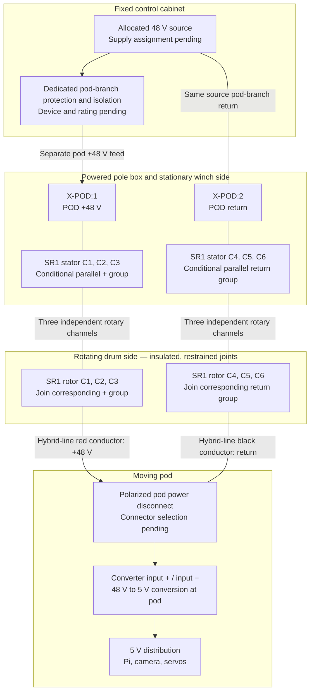

# Pole-base boxes and powered-line wiring

**Baseline connection plan; electrical implementation unverified.** Use with the [motor and encoder terminal schedule](wiring.md). This page covers the local boxes near the bottom of the four poles and the additional pod-power circuit at one winch. Mains remains in the [control cabinet](../control-cabinet/README.md).

`X-MOTOR`, `X-POD`, and `SR1` below are documentation identifiers proposed for the terminal schedule, not manufacturer connector names or approved part selections. Record which physical axis A–D carries the powered line before labeling the installation; no axis is assigned here. The powered-line corner and dock corner must each be identified rather than assumed to be the same.

## Connections required at every pole box

| Cable or interface | Box connection | Required completion before construction |
| --- | --- | --- |
| Motor branch from cabinet | `X-MOTOR:1` = protected +48 V → driver `V+`; `X-MOTOR:2` = same branch return → driver `V-` | Cabinet source/protection ID, conductor size, polarity marking, length, and service-isolation method |
| Outdoor Cat5e control run | Axis STEP/DIR and their dedicated returns → driver input interface in [wiring.md](wiring.md) | Actual input terminal labels, individual conductor assignment, 3.3 V compatibility, and field signal testing |
| Motor cable to same-axis motor | Driver `A+`, `A-`, `B+`, `B-` → matched harness | Use the verified-reference color/pin table in [wiring.md](wiring.md) |
| Encoder cable to same-axis motor | Driver encoder block → matched harness | Keep feedback paired with its motor; distinguish signal black from shield lead |
| Home/reference and independent limits | Reserved interface; no terminal assignment yet | Sensor part, supply, input circuit, GPIO, polarity, return path, cable failure response, and routing |
| Driver enable and alarm | Reserved interface; no terminal assignment yet | Input/output circuit, GPIO, polarity, startup behavior, and fault response; reserved Cat5e pairs alone do not complete this circuit |
| Bonding/shields | As required by the reviewed cabinet and field design | Identify PE, chassis, shields, signal ground, and power returns separately; document any intentional bonds |

Each cable entry needs a cable ID, endpoint label, suitable gland, strain relief, and drip-loop/routing detail. Keep the motor/power wiring separated from encoder and control wiring according to the selected equipment's installation requirements. Secure spare conductors individually, protect unused entries, and keep terminals clear of water paths, moving parts, and service access. Enclosure sealing, drainage/condensation control, driver cooling, terminal wire capacity, strip length, ferrules, and tightening torque require the actual component instructions.

The three ordinary boxes have the motor branch and local interfaces above. The fourth also has the independent pod branch below. Do not add a local bridge between the two positive feeds or use a control-pair return for either power circuit.

## Additional circuit at the powered winch

The [winch baseline](README.md) uses a six-channel slip ring with three contacts proposed in parallel for each polarity. The [canonical BOM parts](../../../bom/catalog/parts.json) identify `capsule-slip-ring-6x2a`, `pod-power-wire-red-awg26`, and `pod-power-wire-black-awg26`. These selections do not establish an approved current rating for the complete circuit.

The slip-ring offer has no manufacturer SKU or committed lead-color pinout. **SR1 channels C1–C6 below are logical labels to assign after identifying and continuity-checking the actual channels. They are not physical pin numbers or a color code.** The three-channel parallel arrangement remains conditional on manufacturer permission and a reviewed protection design. Do not join channels solely from this diagram or infer a 6 A usable rating.

The motor circuit continues separately through `X-MOTOR` to the CL57Y-V20. The pod feed does not pass through the driver's `VCC`, encoder terminals, or motor phase outputs. Source-return relationships and any bonding remain part of the cabinet design; separate routing here does not imply galvanic isolation.

### Powered-line connection schedule

| From | To | Connection detail |
| --- | --- | --- |
| Cabinet protected pod +48 V output | `X-POD:1` | Dedicated pod feed, labeled at both ends |
| Same cabinet source's pod return | `X-POD:2` | Dedicated return alongside the feed |
| `X-POD:1` | SR1 stationary C1, C2, C3 | Conditional + group; use rated distribution/joints accepting the actual conductors |
| `X-POD:2` | SR1 stationary C4, C5, C6 | Conditional return group |
| SR1 rotating C1, C2, C3 | Hybrid-line red conductor | Insulated, mechanically restrained rotating + joint |
| SR1 rotating C4, C5, C6 | Hybrid-line black conductor | Insulated, mechanically restrained rotating return joint |
| Hybrid-line red at pod | Polarized connector + contact → converter input + | Contact number and converter terminal name depend on selected parts |
| Hybrid-line black at pod | Polarized connector return contact → converter input − | Preserve polarity through both connector halves |

Do not put several wires under one screw unless the terminal is rated for that combination. Record the actual stator/rotor wire colors for each C1–C6 channel in the as-built schedule before forming the groups. Keep stationary leads anchored to the fixed structure and rotating leads anchored to the drum assembly so the slip ring, joints, and conductor terminals take no line tension.

At the drum exit, preserve independent Dyneema tensile termination and insulated electrical termination. The conductors remain mechanically slack relative to the Dyneema through the drum, top pulley, span, and pod transition. The [hybrid-line construction](../positioning-lines/README.md) owns wrap pitch, extra conductor length, abrasion protection, and fatigue qualification. The [pod](../camera-pod/README.md) owns conversion and 5 V distribution.

## Protection, service, and completion record

- **Branch sizing:** record minimum/maximum source voltage, pod continuous/peak demand and converter inrush, fixed and moving conductor lengths, voltage drop, and the weakest conductor/contact/connector rating. Select DC-rated protection and isolation with suitable fault interruption capability. The fine AWG26 moving line needs its own protection basis; the motor-branch protection is not a substitute. If the upstream protection cannot protect the thinner section, resolve additional protection before that transition.
- **Slip-ring qualification:** obtain the actual model's voltage, current, parallel-contact permission, speed, environment, and life limits. Evaluate uneven current sharing and one contact opening as well as shorts. If paralleling is unsupported, revise the selection/design before assembly.
- **Isolation:** document how to isolate both motor and pod branches at the powered pole, and label the box with both cabinet isolation points. Turning off the driver branch does not establish that the pod branch is dead. Define pod power behavior during emergency stopping with the existing safety design; this diagram does not choose a stop circuit. Secure the suspended mechanism before isolation and confirm absence of voltage before handling terminals.
- **Unpowered inspection:** disconnect electronics, identify each slip-ring channel individually through rotation, check unintended inter-channel connections, then check end-to-end grouped polarity. Use an appropriate insulation-test method with driver, encoder, converter, and other sensitive electronics disconnected. Inspect strain relief and clearance over full travel.
- **Powered acceptance:** in a secured commissioning setup, verify polarity and voltage at the pod connector before connecting the converter, then measure the 48 V input and 5 V output under representative load and maximum extension. Record transient/dropout behavior during rotation, joint/contact temperatures, protection response, and recovery after interruption. Link results from the [commissioning plan](../../operations/prototype-and-commissioning.md).

Before construction, the box drawing still needs actual terminal/connector/gland parts, cable dimensions and lengths, fuse and isolator selections, torque values, mounting/routing, bonding, complete home/limit/enable/alarm circuits, and the physical powered-axis assignment. These are outstanding implementation details; the connection plan is not bench or installed validation.
