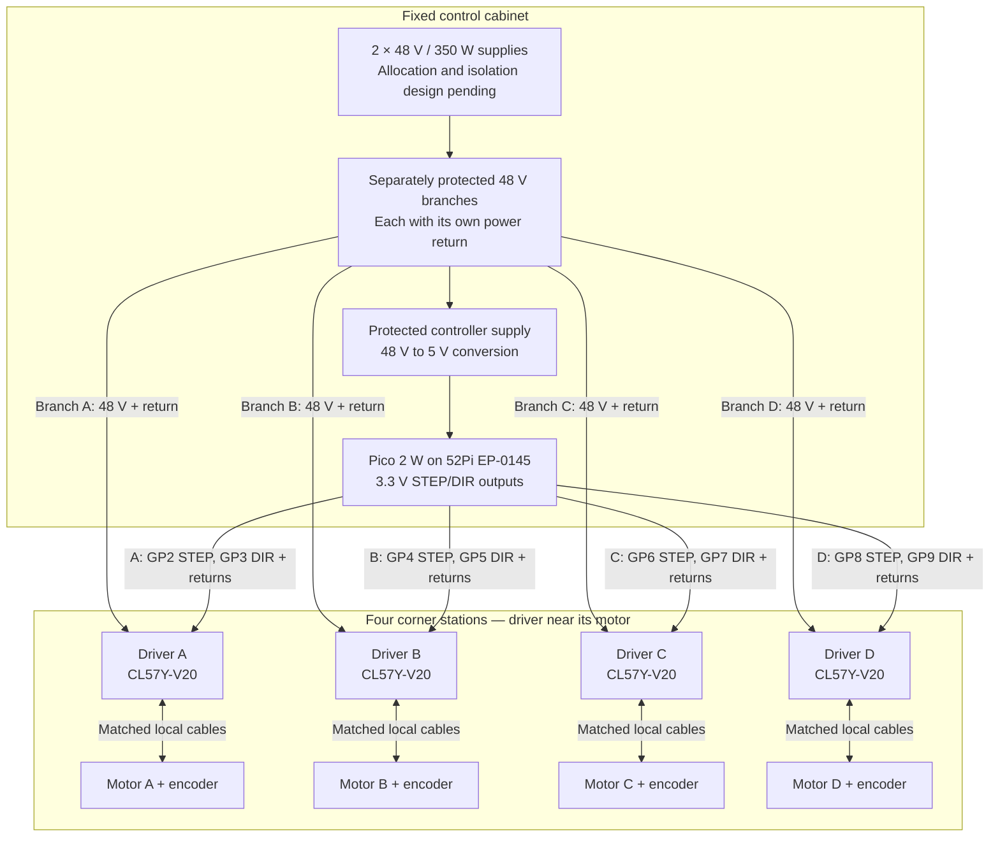
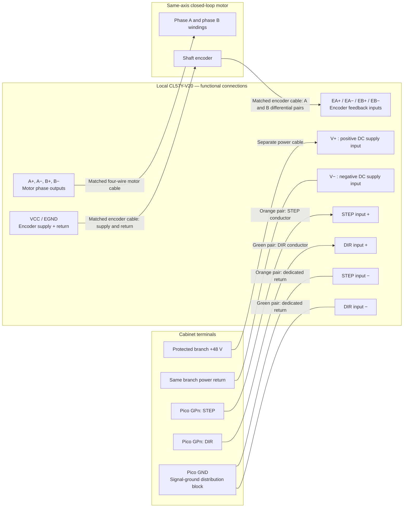

# Winch motor and controller wiring

**Baseline wiring concept — unverified; not a construction terminal schedule.** These diagrams expand the existing [winch](README.md), [control cabinet](../control-cabinet/README.md), and [STEP/DIR interface](../../system/interfaces-and-operating-states.md) baseline. They show four local CL57Y-V20 drivers and a cabinet-mounted Pico 2 W. The motor/encoder section records manufacturer-published wire colors, connector pins, and driver terminal labels; delivered-hardware inspection, protection ratings, and the final enable/alarm/home circuits remain open.

## Four-axis overview

For pole-base box entries, local terminal identifiers, and the separate slip-ring/pod-power path at the powered winch, see [pole-box and powered-line wiring](pole-box-wiring.md).

Solid arrows show power or control paths; motor links include a separate encoder feedback cable. The distribution block represents separately protected circuits, **not a connection between the two supplies' outputs**. Supply-to-load allocation remains unresolved.



Each axis has one point-to-point outdoor Cat5e control cable and a separate power cable. The matched motor and encoder cables stay local, approximately 2 m in the repository baseline. Encoder feedback closes the loop at the driver; it is not wired to the Pico in this baseline.

## One-axis connection detail

Repeat this circuit for A–D using the GPIO table below. STEP/DIR input labels are **functional endpoints**, not verified connector positions. The drawing expresses the baseline as a common-return, positive-input drive concept; confirm the delivered driver's input circuit and compatibility before termination.



The diagram does not connect the signal-ground block to the driver power return or protective earth. Their bonding/isolation arrangement needs the reviewed cabinet design. Dedicated STEP/DIR returns carry signal current; they must not carry motor supply current. Encoder supply and return belong to the matched driver/encoder interface and must not be substituted with Pico power pins.

### Axis and control-cable schedule

GPIO names below are Pico `GP` labels exposed through the terminal board, not physical header pin numbers.

| Axis | Pico STEP → driver STEP input + | Pico DIR → driver DIR input + | Cable |
| --- | --- | --- | --- |
| A | GP2 | GP3 | Dedicated Cat5e run A |
| B | GP4 | GP5 | Dedicated Cat5e run B |
| C | GP6 | GP7 | Dedicated Cat5e run C |
| D | GP8 | GP9 | Dedicated Cat5e run D |

| Twisted pair | Cabinet endpoint | Local driver endpoint | Status |
| --- | --- | --- | --- |
| Orange / white-orange | One conductor: axis STEP GPIO; other conductor: dedicated Pico GND return | GPIO conductor → STEP input +; return conductor → STEP input − | Baseline pair function; individual conductor colors to be assigned in the reviewed schedule |
| Green / white-green | One conductor: axis DIR GPIO; other conductor: dedicated Pico GND return | GPIO conductor → DIR input +; return conductor → DIR input − | Baseline pair function; individual conductor colors to be assigned in the reviewed schedule |
| Blue / white-blue | Reserved | Reserved | ENABLE or ALARM circuit not designed |
| Brown / white-brown | Spare | Spare | No assigned circuit |

The pair names identify twisted pairs, not an Ethernet/RJ45 pinout. Label each conductor's function at both ends; use the same assignment on every axis. The spare pairs do not establish a home-switch or safety circuit.

### Local motor and encoder harness

This mapping applies to the manufacturer's published `4-CLYS30-V20` configuration: `23HS40-5004D-E1000` motor, `CE2-M2-20` extension harness, and `CL57Y-V20` driver. Sources checked on 2026-09-08:

- [Exact four-axis kit: motor/encoder connection and extension-cable tables](https://www.omc-stepperonline.com/ys-series-4-axis-closed-loop-stepper-cnc-kit-v2-0-3-00nm-424-83oz-in-nema-23-motor-w-2-0m-cables-power-supply-4-clys30-v20).
- [Manufacturer's front-facing CL57Y-V20 photograph: terminal labels and order](https://www.omc-stepperonline.com/image/cache/catalog/stepper-driver/CL57Y-V20-1-1-500x500.jpg).

The wire-to-terminal mapping below combines those two references. **Colors refer to the extension harness's driver-end wires**, not necessarily the short leads emerging from the motor. Keep the motor-side connectors mated to their matching extension connectors. Repeat for each axis, keeping its motor and encoder on the same driver.

#### Motor wires → driver motor/power terminal block

| Extension wire color | Motor connector pin | Driver terminal label | Function |
| --- | --- | --- | --- |
| Black | 1 | `A+` | Motor phase A positive end |
| Green | 2 | `A-` | Motor phase A negative end |
| Red | 3 | `B+` | Motor phase B positive end |
| Blue | 4 | `B-` | Motor phase B negative end |

The same driver block also contains `V+` and `V-`. Connect the separately protected branch `+48 V` to `V+`, and that branch's power return to `V-`. These two supply conductors are separate from the four motor wires.

#### Encoder wires → driver encoder terminal block

| Extension wire color | Encoder connector pin | Driver terminal label | Function |
| --- | --- | --- | --- |
| Yellow | 11 | `EB+` | Encoder channel B positive |
| Green | 12 | `EB-` | Encoder channel B negative |
| Black (signal conductor) | 1 | `EA+` | Encoder channel A positive |
| Blue | 13 | `EA-` | Encoder channel A negative |
| Red | 2 | `VCC` | Encoder power from driver |
| White | 3 | `EGND` | Encoder power return |

The connector pin numbers above are **motor/encoder harness connector contacts**, not numbered driver screw terminals. Identify driver connections by the printed terminal labels. Use molded connector numbers or the connector drawing when checking continuity; a mating-face view and a wire-entry view are mirrored.

#### Terminal-by-terminal wiring diagram

Viewed with the driver's printed front label upright and its terminal strip on the right, the manufacturer's photograph shows the following top-to-bottom order. The control-input block sits above these two blocks. Follow the delivered unit's printed labels if its orientation differs.

```text
MATCHED EXTENSION HARNESS                     CL57Y-V20 DRIVER
                                             ENCODER BLOCK (top to bottom)
Encoder pin 11 -- yellow -------------------- [ EB+  ]
Encoder pin 12 -- green --------------------- [ EB-  ]
Encoder pin  1 -- black (signal) ------------ [ EA+  ]
Encoder pin 13 -- blue ---------------------- [ EA-  ]
Encoder pin  2 -- red ----------------------- [ VCC  ]
Encoder pin  3 -- white --------------------- [ EGND ]

                                             MOTOR / POWER BLOCK (top to bottom)
Motor pin 1 ----- black --------------------- [ A+   ]
Motor pin 2 ----- green --------------------- [ A-   ]
Motor pin 3 ----- red ----------------------- [ B+   ]
Motor pin 4 ----- blue ---------------------- [ B-   ]
Protected branch +48 V ---------------------- [ V+   ]
Same branch power return ------------------- [ V-   ]
```

`EA+`/`EA-` and `EB+`/`EB-` are encoder inputs; `A+`/`A-` and `B+`/`B-` are motor power outputs. In particular, the **red encoder wire goes to `VCC`, not `V+`**. The white encoder return goes to `EGND`, not a motor phase terminal. Colors repeat between the two cables, so identify the cable before selecting a terminal.

The kit page also identifies a separate **thick black shielding lead** and permits leaving it unconnected. Keep that lead distinct from the black encoder signal conductor connected to `EA+`. Insulate and secure an unused shield lead; any shield bonding must follow the reviewed field grounding design.

#### Harness inspection before power-on

1. Isolate driver power and wait for discharge before connecting or disconnecting either harness. Secure the mechanism against movement.
2. Confirm the delivered motor, driver revision, and extension cable match the reference configuration. If labels or colors differ, resolve the matching manufacturer's pinout before applying this schedule.
3. With the extension harness disconnected at both ends, check each listed connector contact to its driver-end conductor for continuity and check for unintended shorts. Do not apply an insulation tester through connected driver or encoder electronics.
4. Terminate by the driver labels, check polarity and strand containment, and provide strain relief. Keep the two phase pairs and the encoder feedback on the same axis.
5. Record the inspected mapping and verify direction, feedback, and alarm behavior in a secured commissioning setup before applying line load. Correct configured direction through the reviewed driver/controller setup; do not casually swap phase or encoder wires to reverse a closed-loop motor.

## Unresolved connections and verification

- **3.3 V signaling:** the [CL57Y-V20 product page](https://www.omc-stepperonline.com/y-series-v2-0-closed-loop-stepper-driver-0-7-0a-24-50vdc-for-nema-17-23-24-stepper-motor-cl57y-v20) describes a 5 V/24 V input selector. That alone does not establish direct Pico compatibility. Verify the V2.0 manual, selector setting, input thresholds/current, Pico output capability, pulse timing, and real cable performance before energizing this concept. The linked manual download could not be retrieved during this documentation update (2026-09-08), so exact input-terminal mapping remains unverified.
- **Enable, alarm, home, and limits:** define GPIO allocation, voltage interface, polarity, cable-failure detection, and startup/fault behavior. Do not infer that reserved conductors or omitted enable wiring provide a safe stop. See the [safety case](../../system/safety-case.md).
- **Power and bonding:** finalize supply allocation, branch protection, conductor sizes, voltage drop, transient/regenerative voltage handling, signal-ground/return/PE relationships, shields, and enclosure bonding. Do not parallel supply outputs without manufacturer permission and a reviewed design.
- **Powered-line winch:** follow the [pole-box and powered-line connection plan](pole-box-wiring.md) for the separate protected pod branch, stationary/rotating slip-ring sides, and red/black hybrid-line conductors. Slip-ring lead identification and permission to parallel contacts remain unresolved.
- **Acceptance:** issue an as-built terminal schedule, then record continuity/polarity inspection, unloaded direction and encoder checks, loaded signal-integrity/thermal tests, and reset/alarm/home/stop behavior in the [commissioning plan](../../operations/prototype-and-commissioning.md). No bench or installed wiring validation is claimed here.
