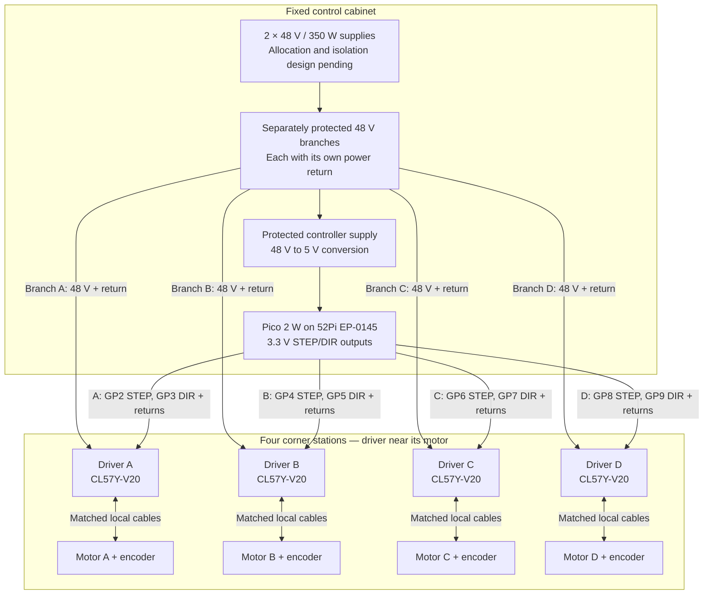

# Winch motor and controller wiring

**Baseline wiring concept — unverified; not a construction terminal schedule.** These diagrams expand the existing [winch](README.md), [control cabinet](../control-cabinet/README.md), and [STEP/DIR interface](../../system/interfaces-and-operating-states.md) baseline. They show four local CL57Y-V20 drivers and a cabinet-mounted Pico 2 W. Terminal positions, protection ratings, and the final enable/alarm/home circuits remain open.

## Four-axis overview

Solid arrows show power or control paths; motor links include a separate encoder feedback cable. The distribution block represents separately protected circuits, **not a connection between the two supplies' outputs**. Supply-to-load allocation remains unresolved.

Each axis has one point-to-point outdoor Cat5e control cable and a separate power cable. The matched motor and encoder cables stay local, approximately 2 m in the repository baseline. Encoder feedback closes the loop at the driver; it is not wired to the Pico in this baseline.

## One-axis connection detail

Repeat this circuit for A–D using the GPIO table below. STEP/DIR input labels are **functional endpoints**, not verified connector positions. The drawing expresses the baseline as a common-return, positive-input drive concept; confirm the delivered driver's input circuit and compatibility before termination.

The diagram does not connect the signal-ground block to the driver power return or protective earth. Their bonding/isolation arrangement needs the reviewed cabinet design. Dedicated STEP/DIR returns carry signal current; they must not carry motor supply current. Encoder supply and return belong to the matched driver/encoder interface and must not be substituted with Pico power pins.

### Axis and control-cable schedule

GPIO names below are Pico `GP` labels exposed through the terminal board, not physical header pin numbers.

| Axis | Pico STEP → driver STEP input + | Pico DIR → driver DIR input + | Cable |
| --- | --- | --- | --- |
| A | GP2 | GP3 | Dedicated Cat5e run A |
| B | GP4 | GP5 | Dedicated Cat5e run B |
| C | GP6 | GP7 | Dedicated Cat5e run C |
| D | GP8 | GP9 | Dedicated Cat5e run D |

| Twisted pair | Cabinet endpoint | Local driver endpoint | Status |
| --- | --- | --- | --- |
| Orange / white-orange | One conductor: axis STEP GPIO; other conductor: dedicated Pico GND return | GPIO conductor → STEP input +; return conductor → STEP input − | Baseline pair function; individual conductor colors to be assigned in the reviewed schedule |
| Green / white-green | One conductor: axis DIR GPIO; other conductor: dedicated Pico GND return | GPIO conductor → DIR input +; return conductor → DIR input − | Baseline pair function; individual conductor colors to be assigned in the reviewed schedule |
| Blue / white-blue | Reserved | Reserved | ENABLE or ALARM circuit not designed |
| Brown / white-brown | Spare | Spare | No assigned circuit |

The pair names identify twisted pairs, not an Ethernet/RJ45 pinout. Label each conductor's function at both ends; use the same assignment on every axis. The spare pairs do not establish a home-switch or safety circuit.

### Local motor and encoder harness

| Driver function | Motor endpoint | Wiring requirement |
| --- | --- | --- |
| A+ and A− | Phase A winding ends | Preserve the matched harness phase assignment |
| B+ and B− | Phase B winding ends | Preserve the matched harness phase assignment |
| Encoder supply and return | Encoder power | Use the matched encoder harness |
| Encoder A+ and A− feedback | Encoder channel A | Preserve differential polarity |
| Encoder B+ and B− feedback | Encoder channel B | Preserve differential polarity |

The manufacturer's [V2.0 kit connection tables](https://www.omc-stepperonline.com/ys-series-1-axis-3-00nm-424-83oz-in-nema-23-closed-loop-stepper-kit-v2-0-w-power-supply-1-clys30a-v20) identify motor phases and encoder functions. This is a related kit reference, not a replacement for the selected four-axis BOM. Connector cavity numbers and wire colors are intentionally omitted until the delivered motor, cable, and driver revisions are checked together.

## Unresolved connections and verification

- **3.3 V signaling:** the [CL57Y-V20 product page](https://www.omc-stepperonline.com/y-series-v2-0-closed-loop-stepper-driver-0-7-0a-24-50vdc-for-nema-17-23-24-stepper-motor-cl57y-v20) describes a 5 V/24 V input selector. That alone does not establish direct Pico compatibility. Verify the V2.0 manual, selector setting, input thresholds/current, Pico output capability, pulse timing, and real cable performance before energizing this concept. The linked manual download could not be retrieved during this documentation update (2026-09-08), so exact input-terminal mapping remains unverified.
- **Enable, alarm, home, and limits:** define GPIO allocation, voltage interface, polarity, cable-failure detection, and startup/fault behavior. Do not infer that reserved conductors or omitted enable wiring provide a safe stop. See the [safety case](../../system/safety-case.md).
- **Power and bonding:** finalize supply allocation, branch protection, conductor sizes, voltage drop, transient/regenerative voltage handling, signal-ground/return/PE relationships, shields, and enclosure bonding. Do not parallel supply outputs without manufacturer permission and a reviewed design.
- **Powered-line winch:** its slip ring uses the separate protected pod-power branch described in the [positioning-line documentation](../positioning-lines/README.md). It does not connect to the motor phase outputs or encoder harness.
- **Acceptance:** issue an as-built terminal schedule, then record continuity/polarity inspection, unloaded direction and encoder checks, loaded signal-integrity/thermal tests, and reset/alarm/home/stop behavior in the [commissioning plan](../../operations/prototype-and-commissioning.md). No bench or installed wiring validation is claimed here.
