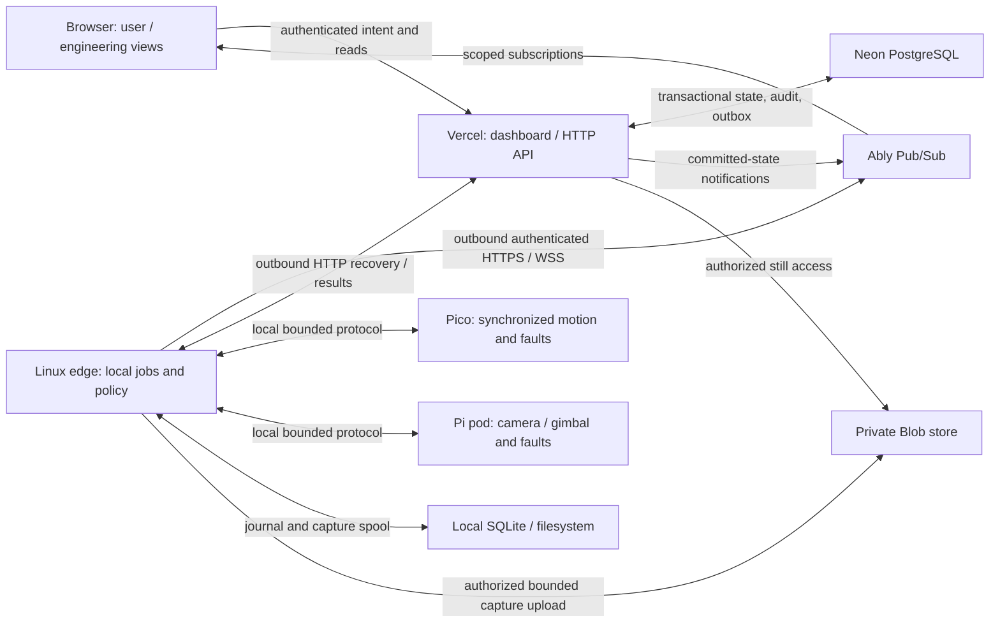

# ADR-0005: Software architecture and deployment boundaries

- Status: Accepted when merged; proposed until then
- Date: 2026-10-07
- Work record: [#13](https://github.com/gredice/arbi/issues/13)
- Evidence: [bounded transport feasibility record](../evidence/software-transport-feasibility.md)

## Context

ARBI needs an online dashboard in Gredice's Vercel team, user and engineering modes, real-time status, bounded robot/camera controls, and dashboard-managed updates. The current repository contains engineering documentation and BOM/CAD tooling; none of those operational software services is implemented. Deployment in the Gredice team does not require moving this repository before V1.

The Internet connection uses Wi-Fi backed by mobile data. Control, telemetry, images, live viewing, retries and updates all consume that allowance. Viewing and manipulation also need a durable audit trail. Recording is deferred and disabled initially.

The [local control baseline](../system/architecture.md), [simulator boundary](0004-simulator-boundary.md) and [safety case](../system/safety-case.md) remain binding. Commercial drivers receive encoder feedback; the Pico currently does not. Measured pod position, line tension and encoder telemetry must not be invented. A docked pod does not establish update-safe line clearance during a controller reset or loss of power.

## Decision and evidence status

“Selected” establishes the implementation direction after this ADR merges. It does not assert provisioning, deployed interoperability, performance, physical acceptance or provider-account access. Changes to selected choices need a reviewed amendment or replacement ADR.

| Boundary | Selected choice | Evidence still required / owner |
| --- | --- | --- |
| Dashboard and HTTP API | Next.js/TypeScript, Vercel Functions in a dedicated ARBI project in the Gredice team; one web/API deployment | Identity adapter [#17](https://github.com/gredice/arbi/issues/17), dashboard [#39](https://github.com/gredice/arbi/issues/39), deployment [#33](https://github.com/gredice/arbi/issues/33) |
| Outbound realtime | Ably Pub/Sub with scoped short-lived tokens; notifications accelerate recovery from authoritative HTTP state | Provider-account, mobile reconnect, deployment churn and quota tests [#29](https://github.com/gredice/arbi/issues/29) |
| Durable cloud state | PostgreSQL hosted by Neon, accessed only by the cloud service through server-side pooled connections | Transactions, migration/restore tests, region and account provisioning [#28](https://github.com/gredice/arbi/issues/28), [#47](https://github.com/gredice/arbi/issues/47) |
| Capture object storage | Private Vercel Blob store; Postgres owns metadata and authorization | Bounded upload/download, deletion, privacy and access tests [#22](https://github.com/gredice/arbi/issues/22) |
| Edge runtime and persistence | Supervised Node.js/TypeScript service on Linux; local SQLite journal and bounded filesystem capture spool | Hardware, distribution, storage/power-loss durability and local transport selection [#23](https://github.com/gredice/arbi/issues/23), [#30](https://github.com/gredice/arbi/issues/30) |
| Pico and pod | Independent local motion firmware and Pi camera/gimbal service; neither accepts browser/cloud actuator traffic | Instrumentation/safety authority [#15](https://github.com/gredice/arbi/issues/15), local adapters [#23](https://github.com/gredice/arbi/issues/23), runtime [#31](https://github.com/gredice/arbi/issues/31), [#32](https://github.com/gredice/arbi/issues/32) |
| Live media | Separate session authorization/signaling and media plane; no continuous video through web API or Pub/Sub | WebRTC plus TURN is a **proposal**, pending Pi 3A+, encoder, NAT and relay tests [#43](https://github.com/gredice/arbi/issues/43) |
| Updates | GitHub-triggered web deploys and separately published immutable signed module artifacts; installation is a distinct authorized local transaction | Manifest [#24](https://github.com/gredice/arbi/issues/24), Pico recovery [#71](https://github.com/gredice/arbi/issues/71), Linux recovery [#44](https://github.com/gredice/arbi/issues/44), orchestration [#73](https://github.com/gredice/arbi/issues/73) |

The [feasibility record](../evidence/software-transport-feasibility.md) combines current primary provider documentation with an executable local recovery experiment. It supports this bounded selection, not a claim of a deployed transport. There is no provider provisioning in this change.

## Ownership and runtime boundaries

Arrows show logical message paths; the edge initiates every Internet connection. There is no inbound site port, browser-to-Pico link or cloud STEP/DIR loop. Media bytes and firmware downloads use separately bounded transfer paths.

| Owner | Responsibilities | Authority limit |
| --- | --- | --- |
| Cloud/API | Authenticate people/devices, authorize site operations, persist intent, exclusive control leases, inventory, image metadata, audit, usage, release availability and query history | May request work; cannot override local limits, clear a local fault remotely by implication, or certify update safety |
| Browser | Show user workflow and an engineering view of available diagnostics; request jobs, bounded controls, viewing and updates | Engineering mode changes presentation; explicit permissions govern authority in both modes |
| Edge | Translate bed/plant targets, persist/sequence jobs, enforce local configuration/weather/state policy, own local control sessions, cache/upload captures, meter WAN, journal audit and stage updates | Accepts only compatible, current authorized intent; cannot replace MCU limits or independent cabinet protection |
| Pico | Generate synchronized STEP/DIR; reject expired/out-of-envelope motion; enforce local command liveness, reset/watchdog behavior and available fault inputs | Local stopping/fault response never waits for cloud, edge database, audit upload or a browser heartbeat |
| Pod | Enforce calibrated gimbal limits and command liveness; maintain safe motion pose, settle, autofocus, capture, report actual health and handle its own reset/faults | No direct remote servo/camera bypass; local interlocks apply even if the cloud grants permission |
| Drivers / physical protection | Commercial motor loop, reviewed enable/alarm/limit/isolation circuits and mechanical restraints | Driver closed-loop control is not evidence of measured pod position or system safety |
| Simulator | Replace plant/device adapters in an explicitly isolated environment using the same versioned contract boundary | No production identity, hardware endpoint, signing authority or live actuator capability |

The detailed instrumentation, supervision and de-energization decision belongs to #15. This ADR requires independent local protection without selecting unresolved wiring or claiming a safe power-off state. A remote stop is a best-effort request; the physical stop path and local fault policy must work without it. Local fault handling continues if cloud authorization, persistence or audit service is unavailable.

## Repository and integration ownership

All paths below are reserved destinations, not new empty workspaces. Node.js `>=24`, the pinned pnpm, Turbo and TypeScript apply to JavaScript/TypeScript. Firmware has its own pinned SDK/toolchain and gains a workspace wrapper only when it exposes working commands. Internal dependencies use `workspace:*`.

| Destination | Ownership and deployment |
| --- | --- |
| `apps/arbi-dashboard` | Authenticated user/engineering dashboard and HTTP API; one Vercel project/release |
| `apps/arbi-docs` | Public documentation/BOM site; separate from authenticated control and private data |
| `apps/arbi-edge-controller` | Supervised Linux edge executable, local persistence, device adapters and transfer policy |
| `apps/arbi-control-cabinet-firmware` | Pico motion/safety firmware and independent device artifact |
| `apps/arbi-pod-firmware` | Pi pod camera/gimbal service and independent Linux application/OS artifacts |
| `apps/arbi-simulator` | Executable simulated installation, isolated from live enrollment |
| `packages/arbi-protocol` | Language-neutral versioned contract/fixtures owned by [#14](https://github.com/gredice/arbi/issues/14); no deployment credentials or provider authority |
| `packages/arbi-gredice` | Identity/site/bed/plant integration adapter, created only with an implemented integration slice |
| `packages/arbi-control`, `packages/arbi-simulation-core` | Portable pure control/reference logic and deterministic simulation when implemented |

`apps/arbi-cloud` is not selected as an additional deployable: the initial HTTP API belongs to the dashboard. Split it only when an implemented workload needs independent release/scale ownership, through a reviewed decision. Provider-specific transport/storage adapters initially belong to the cloud app, not a generic shared package. A later Gredice monorepo move preserves these responsibilities and aligns tool versions/application registration at that time.

The Gredice adapter exposes these conceptual operations; #17 defines the actual integration contract against an approved Gredice interface:

- Resolve a verified human principal and active site membership into explicit view, capture, control, engineering, configuration and update permissions. Validate configured issuer/audience, expiry and environment; never trust a browser-supplied role or site claim. Session/CSRF and origin checks belong at the API boundary.
- Resolve opaque Gredice site, bed and plant IDs into the installation and a versioned local target/calibration reference. Unknown, moved, deleted or cross-site targets fail closed. Private site coordinates/configuration stay in protected storage and on enrolled devices.
- Authorize image/history and job queries against current membership, and return capture results with job/image IDs and provenance. Remote identity or mapping changes cannot silently change local calibration.

No existing Gredice token format, database layout or private deployment is assumed here. Device enrollment is a separate trust domain: per-device credentials, environment/installation binding, rotation and revocation are owned by [#21](https://github.com/gredice/arbi/issues/21). MCU/pod credentials are local module credentials, not browser tokens or cloud API keys.

## Durable state and reconnect behavior

Postgres is authoritative for remote intent, control lease/fencing generations, command outcomes, inventory, configuration references, audit, usage rollups, image metadata and release/update state. Acceptance of remote work must transactionally persist intent plus the authorization/audit record and an outbox entry before notification. Publishing, retrying and consuming the outbox are idempotent. Neither function memory nor Ably presence/history is the durable job or safety database.

Ably carries bounded notifications of committed state and bounded display telemetry. Browser tokens can subscribe only to permitted installation views; they cannot publish actuator commands. Edge tokens can subscribe only to their installation and publish only permitted diagnostics/notifications. API keys remain server-side. Enable provider token revocation before issuing revocable tokens and test permission changes; short expiry alone is not immediate revocation. Every authoritative HTTP request revalidates the enrolled identity or current human membership.

1. The browser requests intent over HTTPS; the API validates scope, compatibility, rate/size limits and the exclusive control session, then commits it.
2. An outbox worker publishes a small notification. The edge initiates authenticated HTTPS to retrieve authoritative work/state; a broker payload alone cannot cause motion.
3. Edge and modules independently check version, configuration, state, command lifetime, fencing and local limits before accepting. Requested, accepted/rejected, running and completed/failed outcomes remain distinguishable. Exact schemas and deadlines belong to #14 and local gates to #15.
4. On disconnect, manual motion authority expires locally. Reconnect never revives the old manual session. Scheduled capture jobs may survive only through an explicit local resume/revalidation policy; they do not become replayable motion messages.
5. On reconnect or deployment change, reauthorize, attach subscriptions, obtain a snapshot with an authoritative committed cursor, and replay bounded pages after that cursor. Merge/deduplicate notifications received during recovery. An expired cursor or event gap requires a new snapshot; no event is interpreted as an instruction merely because it was replayed.

The durable cursor must reflect committed visibility, with snapshot/replay consistency under concurrent writers. A database sequence allocated before commit is insufficient by itself. #29 must test that property on Postgres and across cloud instances; the local single-writer spike does not establish it.

Use bounded queues/pages, telemetry coalescing, rate limits, jittered reconnect backoff and a metered degraded HTTP recovery interval. Broker downtime must not cause an unlimited polling loop or buffered SDK publications that later trigger motion. Stale/offline state is visible. Presence does not grant a control lease; the database owns remote lease identity and local controllers own timeout/fencing enforcement.

SQLite and the filesystem preserve local jobs, accepted configuration identity, outcomes, audit/usage outboxes and capture metadata across service restart. A supervised single writer, atomic journal transitions, checksummed immutable capture files, disk quotas and crash reconciliation are required. Upload acknowledgement precedes deletion. Reserve capacity for control/fault/audit evidence; diagnostic telemetry may be coalesced or discarded with recorded loss. Disk exhaustion inhibits new remote work/captures as needed, never the local stop path. Power-loss durability, corruption recovery and OS update rollback remain bench gates.

## Environment isolation and threat boundaries

| Environment | Identity and resources | Permitted authority |
| --- | --- | --- |
| Fork PR / local | Secret-free synthetic fixtures; no cloud credentials or enrolled devices | Simulation only |
| Trusted preview / test | Dedicated nonproduction Vercel project, Neon project, Ably application, private Blob store, enrollment issuer/audience/keys and test site catalog; per-PR isolated test data where needed | Simulated installation; physically disconnected bench devices only after a separate test gate |
| Production | Separate project/resource credentials, enrollment roots, identity audience, origins, inventory and protected release/update authorization | Live capabilities disabled until accepted installation/configuration and local safety evidence allow them |

Production project previews must receive **no production device, database, broker, Blob or signing credentials**. If that restriction cannot be guaranteed, disable that preview path and use the dedicated test project. Preview database branches come from synthetic test data; never branch production images, identities or site configuration into previews. Environment names or channel prefixes alone are not isolation.

The enrollment issuer, API, broker token issuer, local adapter and device all reject environment/installation mismatch. Production devices trust only production enrollment and API endpoints; test code cannot mint production grants. An explicit simulation/live label is required in navigation and records, but UI labels are not a security control. Test update artifacts use distinct trust roots and cannot be accepted by production modules. Fork builds cannot access release signing or deployment credentials.

Cloud compromise remains a physical-risk boundary: even authorized cloud requests must satisfy local constraints. Commissioning/calibration activation and fault recovery require their separately accepted local procedures. Cloud/API-to-store credentials grant the minimum resource permissions; browser/pod/MCU never receive store or broker administrative secrets. Rate/size limits apply before persistence. Logs, exports, private media and configuration have site-scoped access and retention; public diagnostics must exclude real site/location and credential data.

## Media, mobile data and audit

The pod transfers stills locally to the edge; the edge stages and uploads them through scoped, bounded upload authorization. Private Blob stores the bytes, Postgres the checksum, capture/configuration identity, owner, retention and transfer outcome. Object creation and metadata reconciliation must tolerate interrupted upload. Authorized still reads are bounded server-mediated private-object access with per-access audit; private objects must not gain public cache access through image optimization or a public URL.

Live viewing starts only on an explicit authorized request. The API persists a per-viewer session and audit before signaling the edge/pod; no dashboard mount starts a stream. WebRTC plus authenticated signaling and TURN is the candidate in #43. That issue must select the actual encoder, libraries, stream endpoint, relay provider and whether one upstream stream is shared. TURN allocation alone does not provide viewer authorization, revocation or safe capture concurrency. Media/session grants expire, have idle/absolute limits and are revoked on membership/session changes. A relay/media service, rather than Vercel API handlers or Ably, carries continuous media. Recording/playback remain disabled and outside the initial deployment, pending [#68](https://github.com/gredice/arbi/issues/68).

The edge/gateway is the mobile-WAN accounting authority; pod-to-edge Wi-Fi traffic is a separate LAN measurement. Count upload and download bytes for control, telemetry, auth/signaling, stills, live media, diagnostics and artifacts, including retries, reconnects, protocol overhead and failed transfers. Payload counters do not equal WAN or carrier-billed bytes. Reconcile interface counters with per-transfer/module/session attribution, overhead/unattributed residuals and carrier observations under [#18](https://github.com/gredice/arbi/issues/18), [#26](https://github.com/gredice/arbi/issues/26), [#63](https://github.com/gredice/arbi/issues/63). For shared upstream media, count the uplink once and track relay/downstream usage and each viewer separately.

Budgets, billing periods, reset timezone and transfer priorities are explicit configurable policy, enforced locally as well as presented online. Safety/control liveness has reserved capacity; diagnostic sampling, media quality/session length and deferred uploads adapt to remaining allowance. Artifact sizes and retry headroom are part of update preflight. Budget exhaustion ends or denies nonessential transfers; it never stops local fault handling. Provider cost, WAN usage and carrier billing remain separate metrics.

Audit covers attempted/denied/accepted manipulation, control sessions, configuration and updates, capture requests/results, still access/downloads and live-viewer grants/start/stop/revocation/failure. Future recording includes creation, access/playback, export and deletion before enablement. Each event carries actor/device, environment/site/module, operation/correlation IDs, time provenance, outcome and relevant version; detailed vocabulary is owned by [#19](https://github.com/gredice/arbi/issues/19). A token grant does not prove frames were viewed. API/relay/pod evidence distinguishes authorization, transport/session activity and actual access to the degree measurable.

Cloud append and edge offline spool use durable, deduplicated ingestion and bounded retention; counters are never the audit source. If required audit persistence cannot accept a remote control/media action, reject that action. Local stopping and fault response continue, spool best-effort evidence, and surface any gap; do not manufacture a complete history. Audit access/export is itself authorized and audited. Append-only application permissions, integrity/backup controls and retention review belong to [#27](https://github.com/gredice/arbi/issues/27), [#36](https://github.com/gredice/arbi/issues/36), [#64](https://github.com/gredice/arbi/issues/64).

## Release and update boundaries

GitHub checks precede web production promotion. A trusted change to the configured production branch triggers the web deploy; PR previews use the isolation rules above. Web deployment never flashes hardware. Independent edge, pod and Pico release artifacts/manifests declare target board/module, version, compatibility, sizes/digests, signing identity and provenance. Signed immutable firmware availability appears in the dashboard separately from installed, staged, trial and confirmed versions.

An authorized update request is audited and locally checked for compatible hardware/configuration, free storage, mobile budget, power and an accepted update-safe mechanical/electrical state. Download, verify, stage, trial boot, local health check and confirm/rollback are module-specific. Update-time fault/stop protection cannot depend on the module being rebooted. No automatic installation follows a GitHub push or reconnect.

Pico recoverable signed firmware, Pi application/OS trial boot and edge Linux recovery need separate implementations and interruption tests. A/B capacity, boot verification, signing-key rotation, rollback policy and configuration migration are requirements/gates, not existing capabilities. The dashboard inventories drivers, servos, camera and passive hardware honestly; no OTA support is claimed for them without a documented update interface. `Docked` or `Parked` alone cannot pass update preflight while power-loss restraint and accessible-line clearance are unresolved.

## Development order and consequences

Develop the authenticated online dashboard with both modes against an isolated simulated installation over the selected real cloud-edge protocol first ([#62](https://github.com/gredice/arbi/issues/62)). Expose truthful unavailable/stale/commanded/estimated/measured diagnostics, command lifecycle, release availability, usage and audit. This may precede physical roadmap phases because it has no production actuator credentials or authority. It is a software milestone, not installed-system acceptance.

Real remote operation remains behind #15, reviewed local firmware/adapters, bench evidence, accepted calibration/commissioning and the [release gates](https://github.com/gredice/arbi/issues/79). Replacing simulated adapters cannot silently enable it. No cloud/browser dependency is added to local stopping or fault handling.

This selection adds managed-service cost and vendor integration work. PostgreSQL authority and app-owned provider adapters limit transport lock-in, but provider limits, outages and mobile cost require measured acceptance. Separate environments and releases cost more operational effort and prevent web preview/deploy activity from acquiring live-device authority.

## Alternatives considered

- **Vercel-native WebSockets plus external coordination:** feasible in current public beta; connection duration, instance/deployment changes and the experimental Next.js upgrade interface still require recovery and external state. Prefer Ably's scoped token/subscription/recovery facilities for the initial slice; reconsider after measured operational/cost evidence.
- **HTTPS polling only:** retained as bounded recovery, but frequent polling for normal real-time status wastes mobile data and adds latency. It remains a useful fallback when the broker is unavailable.
- **Self-hosted MQTT/WebSocket broker:** suitable if later device/operational constraints require it; initially adds broker security, patching, failover and environment operations. Pico is not an Internet broker client in this design.
- **Cloud-owned motion, inbound edge ports or browser-to-pod controls:** rejected because network/identity failure would bypass local ownership and enlarge the physical attack boundary.
- **One production database/broker/store with preview prefixes:** rejected because a preview credential or routing mistake could cross the live authority boundary.
- **An early Gredice repository migration or separate cloud app:** unnecessary for the first implemented slice; preserve the public ARBI baseline and a narrow integration adapter.

## References

- [Architecture](../system/architecture.md), [interfaces](../system/interfaces-and-operating-states.md), [roadmap](../project/roadmap.md), [design status](../project/design-status.md)
- [Cabinet](../assemblies/control-cabinet/README.md), [pod](../assemblies/camera-pod/README.md), [encoder wiring](../assemblies/winch/wiring.md), [dock power-loss gap](../assemblies/dock/README.md)
- Current provider documentation, observations and experiment limits are linked in the [feasibility record](../evidence/software-transport-feasibility.md).
