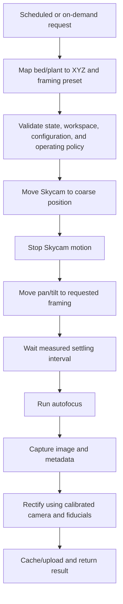

# Imaging and calibration

## Operating intent

ARBI supports scheduled sweeps and on-demand bed or plant captures. Both modes use the same local safety checks, coordinate mapping, motion, gimbal, focus, rectification, storage, and reporting sequence. Priority affects queue order, not safety behavior.

## Capture sequence

The current settling range is approximately 100–300 ms. It is a starting point. Measure representative large and small gimbal moves and increase the interval when needed.

For a normal capture:

- do not reposition the gimbal while the Skycam is moving;
- do not autofocus until Skycam and gimbal motion have stopped and settling time has elapsed;
- do not interpret upload success as capture or motion success;
- keep raw capture, calibration revision, requested/estimated pose, timestamps, and health metadata sufficient to reproduce processing decisions.

## Scheduled sweep

The 30-bed target can use pre-calibrated bed centers and one or more named framing presets per bed. A sweep planner should minimize unnecessary travel while preserving local safety limits, image timing needs, and return-to-dock policy. A stale schedule cannot override maintenance, fault, weather, or exclusion controls.

## On-demand capture

An on-demand request identifies a bed or plant, not an unvalidated motor coordinate. The local edge service resolves the request through versioned site and framing configuration. A plant close-up may select a different X/Y target and pan/tilt preset. Lower-Z motion is permitted only when separately validated for current crop and line clearance.

## Motor homing

Each winch has a home/reference switch. The current recovery concept is:

1. after position loss, move each winch slowly toward a known reference using a bounded homing strategy;
2. establish the spool-angle reference;
3. transform the references into calibrated line-length coordinates;
4. verify that the resulting pose and line state are plausible before entering normal readiness.

The final procedure must define axis order or coordination, direction, reduced force/speed, independent limits, timeout, switch repeatability, cable-tension constraints, failure recovery, and whether the pod must be docked or otherwise restrained. Homing must not create excessive tension or slack.

## Geometric and mechanical calibration

Calibration should distinguish:

- surveyed anchor tangent coordinates;
- home-switch offsets and motor direction;
- steps/encoder counts per drum revolution;
- drum effective radius and helical line-position effects;
- termination offsets and line reference length;
- line elasticity, creep, sag, and temperature effects where significant;
- cable-spider, gimbal, and camera transforms;
- dock PRE-DOCK and capture geometry;
- bed and plant target coordinates.

Every calibration set records the compatible site, line, drum, pod, dock, and software revisions. Replacing or altering a line, drum, termination, pulley, anchor, camera, or gimbal requires a documented compatibility decision and usually recalibration.

## Vision calibration and rectification

Permanent fiducials around the bed area should help estimate actual X/Y offset, camera rotation, perspective tilt, and scale. The result can rectify an image into a consistent canonical bed view even when mechanical positioning differs by a few centimeters.

The vision process needs:

- selected fiducial family, printed size, material, placement, and coordinate survey;
- camera intrinsics and distortion calibration for the released module/focus behavior;
- detection confidence and minimum geometry;
- rejection rather than silent rectification when evidence is insufficient;
- representative tests across sunlight, shadow, wetness, dirt, crop occlusion, camera angles, and aging;
- a method to distinguish camera/pod displacement from fiducial/site movement.

Vision correction reduces the need for expensive mechanical precision but does not make unsafe motion or unknown geometry acceptable.

## Image identity and repeatability

Each result should identify:

- request/job and bed/plant target;
- capture time and clock quality;
- site, calibration, framing, hardware, and software revisions;
- requested pose and relevant estimated/observed pose;
- gimbal command and actual/estimated state available;
- settling interval and autofocus result;
- raw image identity, processed image identity, and rectification status;
- health/fault warnings and whether upload was delayed.

Repeatability acceptance must specify measurable spatial/framing/focus metrics rather than visual impressions alone.

## Offline and failure behavior

Loss of Internet should not invalidate local motion safety. The edge service may cache completed captures and upload later. Failed focus, capture, rectification, or upload should return distinct outcomes and bounded retries; it should not trigger repeated motion indefinitely. A capture failure still ends in the configured idle/docking policy unless a fault requires a different controlled response.

## Acceptance evidence

- Homing repeatability and bounded failure behavior across every axis.
- Coordinate and calibration round-trip tests with known reference vectors.
- Motion arrival error and image rectification error at representative center, edge, and close-up targets.
- Gimbal range, repeatability, measured settling, focus, and framing results.
- Scheduled and on-demand flows with delayed, duplicate, stale, interrupted, and offline requests.
- Raw/processed image and metadata traceability without leaking secrets or unintended private imagery.
- Demonstrated invalidation after incompatible hardware or calibration changes.

## Open questions

- Final per-bed and per-plant target model and framing presets.
- Fiducial family, size, number, placement, weather life, and cleaning/replacement plan.
- Required whole-bed and close-up image quality and repeatability metrics.
- Time synchronization between cloud, edge, MCU, and pod.
- Whether an IMU improves settling detection enough to justify its mass and integration cost.
- Privacy masks, retention, public visibility, and handling of incidental people in images.
