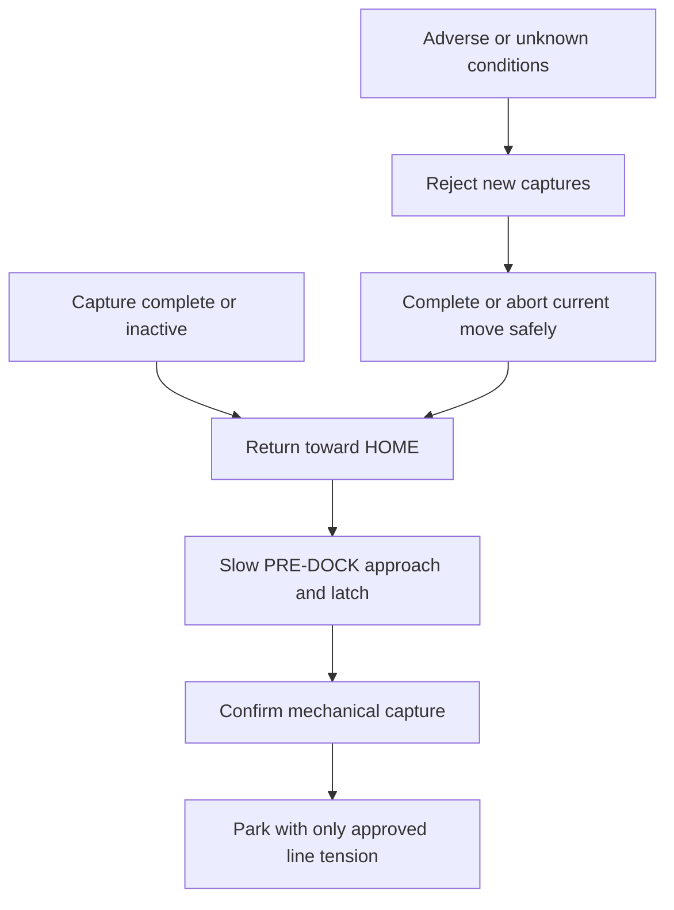

# Weather, parking, and maintenance

## Operating policy

The pod returns to its high HOME dock whenever it is inactive. The dock is the primary weather shelter; the pod rain cap is only brief splash/direct-rain protection.

The V1 baseline deliberately does not use an anemometer or numeric wind-based operating limit. At the same time, it says not to start work when adverse weather is expected or observed. The mechanism that makes that decision is currently undefined. Until a validated local policy or sensing/integration exists, inability to determine acceptable conditions is a stop condition.

## Inactive and weather sequence

Strong wind, lightning risk, rain beyond the approved pod exposure, ice, visibility loss, unusual line motion, or other conditions outside the validated envelope prohibit a new normal capture. The safe response to a condition first detected during motion must be defined by scenario; “always go home” is not safe if the path or dock has become unavailable.

## High parking versus ground-level service

Normal automatic parking remains at the high dock:

- target capture point approximately 2.65–2.70 m;
- target bottom of docked pod approximately 2.4–2.5 m;
- the pod stays out of normal head space while inactive.

Servicing without a ladder is handled separately. A manually initiated `Maintenance` state may lower the pod only after:

1. the work area is physically cleared and controlled;
2. remote and scheduled jobs are inhibited;
3. stored mechanical/electrical energy and recovery behavior are understood;
4. an operator intentionally authorizes the move;
5. the system uses reduced, bounded motion to an approved service position;
6. isolation/lockout is applied before hands enter hazardous areas.

The controller must never enter below-head-height maintenance positioning automatically. Failure recovery must not improvise a low position.

## Parked line policy

V1 does not intentionally slack the four positioning lines. Repository starting values are:

- minimum line height over accessible work or walking areas: at least 2.2 m;
- initial parking-tension experiment: approximately 10–20 N per line;
- actual value chosen from installed measurements, with special attention to the heavier powered line.

The dock latch supports the pod, while the powered winches currently preserve line clearance. Because a normally engaged brake is deferred, total-power-loss line sag is unresolved. Public operation may require bringing a fail-safe brake or other passive clearance control into V1.

## Weather readiness

Before each operating period, confirm:

- conditions are inside a locally defined, evidence-backed envelope;
- no lightning or surge-related stop condition is active;
- lines, posts, guys, anchors, dock, and shelter show no storm damage;
- the pod, dock, pulley keepers, and enclosures are dry/drained enough for approved operation;
- fiducials and optical surfaces are visible and usable;
- no ice, debris, plant growth, or foreign object enters a line, winch, dock, or workspace;
- site access and exclusion controls are effective.

Remote weather forecasts may be one input but cannot prove local line/wind conditions.

## Routine inspection

Define intervals by elapsed time, travel/cycle count, exposure event, and observed condition. At minimum inspect:

- posts, soil movement, guys, anchors, brackets, backing plates, bolts, shackles, pulleys, and corrosion;
- Dyneema, powered conductors, terminations, guides, slip ring, sag, and calibration drift;
- drums, couplings, bearings, guards, home switches, motors, drivers, and abnormal sound/heat;
- pod chassis, line attachments, docking stud, gimbal, ribbon, fasteners, converter, capacitor, connectors, cap, and optics;
- dock arm, funnel, latch, spring, pins, release, sensor, roof, drainage, and debris;
- cabinet protection, seals, terminals, earthing/bonding, labels, moisture, heat, and event logs;
- fiducials, site reference points, paths, privacy/exclusion zones, and vegetation encroachment.

Every inspection identifies the released assembly revisions and records pass, measured result, observation, action, and reviewer. “Looks fine” is not enough for critical discard criteria.

## Maintenance controls

- Prevent remote, scheduled, or automatic start during maintenance.
- Isolate and verify relevant electrical energy.
- Control line tension and mechanical stored energy before opening guards or removing parts.
- Never work below suspended hardware or loaded test equipment.
- Recalibrate after changes that affect geometry, line length, drum radius, camera, gimbal, anchors, or dock.
- Run bounded post-maintenance tests before restoring the full operating envelope.
- Replace parts by stable ID and compatible revision, not appearance alone.

## Return to service

Return to service requires:

- completed work and inspection records;
- all guards, retention, protection, seals, and labels restored;
- compatible configuration/calibration loaded;
- no unresolved critical observation;
- safe homing/recovery and dock test at reduced limits;
- required electrical or structural retest;
- deliberate release from maintenance by an authorized operator.

## Acceptance evidence

- Defined local environmental operating and parking envelope.
- Reliable rejection of new work and bounded response to weather changes during each state.
- Repeated high docking and safe manually controlled maintenance access.
- Measured parked line clearance in normal and relevant fault/power conditions.
- Inspection intervals and discard criteria supported by material/component evidence.
- Demonstrated remote-start inhibition, isolation, lockout, and post-maintenance release.
- Storm/event inspection and recovery procedure.

## Open questions

- How are acceptable wind, rain, lightning, temperature, and ice conditions determined locally?
- What is the safe action when the dock is inaccessible during deteriorating weather?
- Is passive braking required to preserve line clearance through total power loss?
- Which inspections can use telemetry, and which require physical access and measurement?
- What maintenance position and restraint provide safe ground-level service?
- How often do UV-exposed line and printed parts require replacement?
