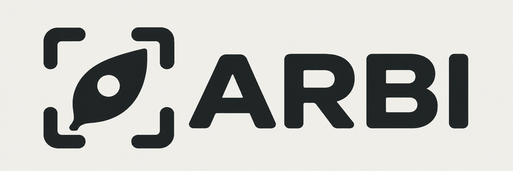

# ARBI brand identity

## Official selection

**Garden Focus** is the official ARBI project logo, selected by the project
owner on **7 October 2026** and recorded in this repository. It combines a leaf,
a circular lens opening and four rounded viewfinder corners to represent
repeatable imaging of raised garden beds. The wordmark is uppercase **ARBI**;
the expanded project name remains **Automatic Raised Bed Imaging system**.

This is a visual identity decision. Engineering status continues to be recorded
in [design status](design-status.md); adopting the logo does not change a
hardware revision, physical interface or validation claim.

## Assets

| Asset | File | Use |
| --- | --- | --- |
| Primary logo | [arbi-logo.png](../assets/brand/arbi-logo.png) | Emblem and wordmark on a warm-white panel; preferred for README files and unknown background themes |
| Transparent logo | [arbi-logo-transparent.png](../assets/brand/arbi-logo-transparent.png) | Emblem and wordmark on a light, uncluttered background |
| Standalone emblem | [arbi-mark-transparent.png](../assets/brand/arbi-mark-transparent.png) | Square avatars and compact identity marks where ARBI is already named |
| Selected artwork | [garden-focus-selection.png](../assets/brand/garden-focus-selection.png) | Unchanged reference from the three-concept exploration; retained for provenance |

Use the supplied files instead of recreating the letterforms with a substitute
font. These are raster PNG assets, not editable vector paths or manufacturing
geometry. The primary and transparent logos are 2172 × 724 px; the emblem is
1254 × 1254 px; the selection reference is 1536 × 1024 px.

## Color and placement

The nominal identity colors follow the
[product design palette](industrial-design.md): charcoal **`#1f2426`** and
warm white **`#f0f0eb`**. The supplied raster artwork is the visual reference;
the hex values specify the intended palette rather than every antialiased pixel.

- Use the primary logo on dark or unknown backgrounds so its light panel keeps
  the charcoal artwork legible. Transparent variants require a light background.
- Keep the original aspect ratio and internal spacing. Preserve the leaf's
  circular opening and all four viewfinder corners.
- Keep clear space around the visible artwork of at least one viewfinder
  bracket's stroke width; the supplied canvases include padding.
- Start at 240 CSS px wide for the full logo and 32 CSS px square for the
  standalone emblem. Check legibility at the intended display size; these are
  usage recommendations, not a tested printing specification.
- Do not stretch, rotate, recolor, add effects, replace the wordmark, or place
  the transparent charcoal artwork over a photograph or dark background.
- Provide accessible text such as `ARBI` when the image names the project.
  Use empty alt text when adjacent text already supplies the same identity.

## Provenance and maintenance

The selected artwork was generated with the built-in image-generation tool.
Transparent logo and emblem variants and a warm-white presentation variant were
prepared from that artwork with the same tool. The
[generation record](../assets/brand/generation.json) preserves the exact prompts
and the input relationship for each file. The unchanged selection reference is
retained alongside the delivery variants.

Future identity changes should update these assets and this guide together in a
reviewed pull request. Repository documentation uses the primary logo;
[scenic concept artwork](../assets/README.md#concept-imagery) remains a separate
illustration of the project. Assets follow the repository's [license](../../LICENSE).
