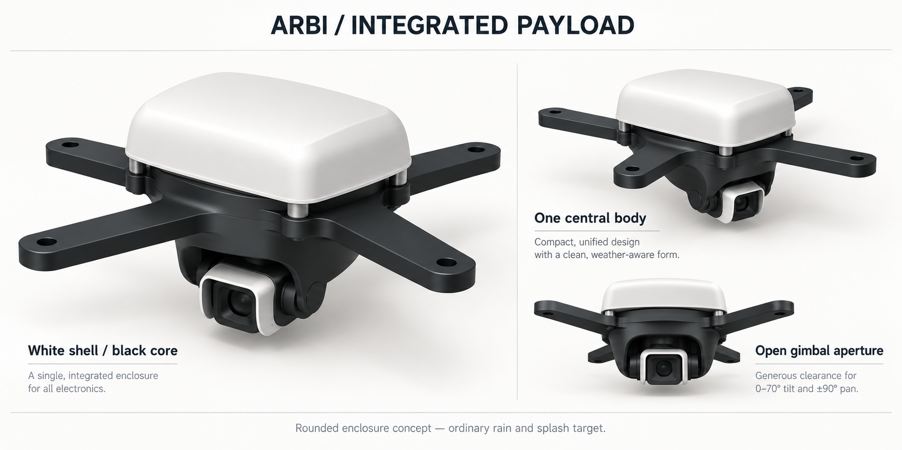

# ARBI industrial design conventions

The owner selected the integrated payload concept on 7 October 2026. This records the selected appearance direction; the artwork is a shape and finish reference, not dimensional CAD or physical evidence. [ADR-0007](../decisions/0007-integrated-product-design.md) records its boundaries. The [compact packaging decision](../decisions/0009-compact-integrated-payload.md) follows the owner's choice to rearrange the electronics to match that concept more closely and becomes the design baseline on merge; physical validation remains pending.

## Product language

| Role | Convention | Preview color |
| --- | --- | --- |
| Protective shell | Warm white, broad rounded crown, continuous perimeter, removable for service | `#f0f0eb` |
| Structural core | Charcoal spider, body, brackets, yoke and cradle; visually one central assembly | `#1f2426` |
| Optical surround | Small white rounded bezel; unobstructed dark lens opening | Shell white |
| Bought metal | Neutral silver, visible where required for assembly and inspection | `#a8b3ba` |
| Electronics | Actual board/component colors in service views | Green PCB / dark components |

These are presentation colors, not a filament, coating, UV rating or material approval. Shared OpenSCAD colors live in [arbi.scad](../../hardware/lib/arbi.scad); mesh renderers use the same roles. Booklets use white backgrounds, dark typography, thin gray dividers, numbered steps and restrained dark arrows. Identify components by IDs and callouts rather than alternate blue/orange product colors.

Use rounded rectangles, capsule-ended arms and broad shoulders. Avoid a stack of unrelated visible electronics boxes. A compact shell covers the fixed electronics; a continuous dark perimeter links the shell visually to the spider. Preserve removable panels, fastener access, drainage, ventilation and harness exits. The one-piece black outer head narrows continuously from its broad upper shoulder to its smallest lower section. It moves in pan around a separate internal carrier, concealing the servo and brackets. Its front/underside opening must clear the full camera tilt and optical envelope; preserve the accepted movement range when shaping it.

Assembly booklet illustrations use opaque white faces with dark silhouettes and
visible feature edges, in the style of furniture assembly instructions. Hidden
edges stay hidden; STL triangulation is omitted. This drawing convention applies
to printed parts, boards and purchased hardware regardless of their product
color. Part IDs and quantities identify components; assembly manifests and GLB
inspection scenes retain the product-role palette above.

## Engineering application

The [payload enclosure configuration](../../hardware/assemblies/camera-pod/payload-enclosure.md) owns the centred 124 × 118 mm upper shell, 13 fabrication models, 16 installed printed pieces, replacement list, harness passages and fasteners. Its electronics deck r0.1.0, white rain hood r0.2.1 and optical surround r0.1.1 remain unchanged; tray r0.2.3 adds a rolled underside shoulder. The compact gimbal replaces the head with r0.1.3, carrier with r0.1.1, and dry cradle/pivot with new integrated r0.1.0 models. The horizontal tilt servo moves 2 mm inboard and raises the camera axis to Y=3, Z=-45. A circular Ø100 mm neck blends into the tapered lower head over 28 mm. The fixed tray shoulder ends in a Ø103 mm throat at Z=-6.1, overlapping the moving neck by 2 mm with a nominal 1.5 mm radial clearance seam. The underside forms one continuous charcoal silhouette while four open-bottom arm reliefs, recessed fastener/CSI access, the rear power breakout and through-drains preserve structure and service. Reprint the tray and outer head together; the compact carrier, cradle and support remain compatible. The head/carrier rotate in pan and the camera/optical surround tilt inside. The separate camera cowl and its four secondary nuts are omitted; M2 × 12 camera screws retain the four primary nuts and eight washers. The spider and dry bench alternative remain unchanged.

The compact revision links its [nominal CAD evidence](../../hardware/assemblies/camera-pod/payload-enclosure-check.md), actual-mesh previews and booklet build. The fresh compact-gimbal build passes its sampled motion, taper, service, tool, port, optical and routing checks. Its 16 installed prints total 253.753 g as a solid-volume PETG estimate at 1.27 g/cm³, including 28.051 g for the outer head; this excludes hardware and electronics and does not replace slicing or weighing. The 170 g complete-pod ceiling, received-hardware fit, pan-servo torque and settling remain open. The outer head’s proposed camera/CSI protection requires new physical rain/splash checks after omitting the separate cowl.

The integrated rain kit remains the preferred public pod preview. `camera-pod-assembly` and `payload-assembly` default to it. Select `show_legacy=true` for the historical camera-pod layout or `show_enclosure=false` for the dry bench kit. `show_hood=false` opens the integrated reference for service; `show_cover=false` opens the dry bench variant. Keep open, exploded and alternative views labelled by configuration. Include neutral and tilted views with their pose angles, so the optical face is visible without hiding the housing proportions. Retain historical fabrication sources for traceability; they are alternatives rather than a combined print list. Do not add the dry deck, cover, optical hood or pan yoke, or the earlier fixed fairing, boot or rear cowl, to the compact kit.

Apply the role palette to winch drum/mount previews and all published booklets. The existing coupling guard is white, while drum, bearing supports and motor stand are dark. Its dimensions are unchanged. Dock protection, corner-station housings and the control-cabinet outer enclosure should use white rounded protective surfaces over dark fixtures when their housing geometry is designed. Existing dock/funnel load and capture surfaces retain their committed dimensions.

The [full winch cover r0.3.0](../../hardware/assemblies/winch/full-cover.md) adds
three/five removable white panels with fascia, rear shields and concealed enclosure fasteners over the existing dark drivetrain, with
explicit nominal clearances, base drilling and service sequence. Its
[geometry record](../../hardware/assemblies/winch/full-cover-check.md) and
open-core assembly views distinguish CAD checks from physical acceptance.

## Preview and publication rules

- Show the covered integrated pod in hero and final assembly views; include open and exploded views for assembly/service.
- Render engineering illustrations from registered CAD/STLs and retain filenames, transforms and source hashes. Mark scenic art as concept imagery.
- Regenerate each PDF and its source/mesh pack after CAD or renderer changes. Include the current revisions and no stale replacement files.
- Keep concept artwork separate from CAD acceptance records. No image, render, simulation or source check demonstrates strength, weather resistance, fit, mass, thermal performance or safe suspension.
- Ordinary rain and splash, +/-90 degree pan and 0..70 degree tilt are targets. Rigid sampled clearance checks must name the tested revision and nominal hardware; actual flexible cables, sealed entries, heat and received-unit fit need physical evidence.
