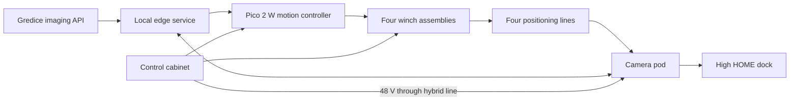
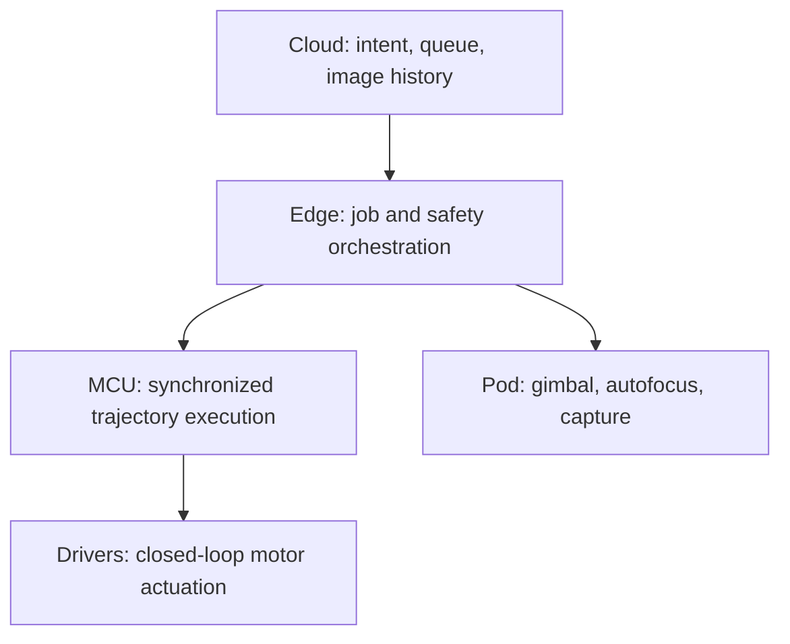

# System architecture

## Overview

ARBI uses four fixed winches and four positioning lines to move one lightweight camera pod above raised beds. Skycam motion provides coarse position; after motion stops, a two-axis gimbal provides fine framing. The local system captures, rectifies, caches, and uploads images requested by a schedule or user.



## Physical architecture

### Site installation

Defines the bed footprint, anchor coordinate frame, access zones, clearances, field routing, fiducials, and as-built survey. See [site installation](../assemblies/site-installation/README.md).

### Four corner stations

Each station supports a top pulley and reacts positioning-line load through its post, guy, anchor, and soil. A winch mounts on the same pole face below the pulley. One corner also supports the dock. See [corner station](../assemblies/corner-station/README.md).

### Four winches and positioning lines

Each winch independently controls one line. Three lines are normal Dyneema; one is a powered hybrid with two conductors and a rotating slip-ring interface. See [winch](../assemblies/winch/README.md) and [positioning lines](../assemblies/positioning-lines/README.md).

### Camera pod and dock

The cable spider carries fixed compute and power electronics. Only the camera and lightweight gimbal articulate. The dock mechanically captures and shelters the inactive pod. See [camera pod](../assemblies/camera-pod/README.md) and [dock](../assemblies/dock/README.md).

### Control cabinet

The cabinet is the fixed boundary for mains input, protection, 48 V conversion, fused branch distribution, motion control, terminal distribution, isolation, and future edge-compute accommodation. See [control cabinet](../assemblies/control-cabinet/README.md).

## Control ownership



- The cloud requests a bed or plant capture and presents results.
- The edge service maps domain targets to physical coordinates, owns the local job/state machine, and rejects work outside local operating policy.
- The motion controller generates synchronized STEP/DIR trajectories and observes local limits and faults.
- Closed-loop drivers control their motors but do not own system-level safety.
- The pod service controls gimbal limits, camera sequencing, local health, and image transfer.
- Loss of Internet must not remove local stopping, docking, or fault-handling behavior.

The exact edge-computer hardware and operating system are open decisions.

### Software responsibility baseline

The current cloud-facing baseline includes operations equivalent to `requestCapture(bedId)`, `requestPlantCapture(plantId)`, `getLatestImage(bedId)`, and `getImageHistory(bedId)`, plus on-demand job priority, image storage/CDN, and health/status presentation. These names are design inputs, not a published API contract.

The local edge service translates bed/plant targets into physical position and framing, queues motion jobs, coordinates the MCU and pod, preserves the stop → gimbal → settle → autofocus → capture order, caches images offline, uploads when possible, and enforces docking/weather/safety policy.

The pod service initializes the camera, applies calibrated servo limits, moves and settles the gimbal, autofocuses, optionally produces a low-resolution check, captures the full-resolution still, transfers it over Wi-Fi, and reports basic health.

## Core engineering models

For fixed anchor coordinates `A`, `B`, `C`, and `D` and requested pod position `P = (x, y, z)`, the current geometric baseline commands the Euclidean anchor distance:

```text
L_i = sqrt((x - i_x)^2 + (y - i_y)^2 + (z - i_z)^2)
```

This equation is only a geometric starting point. It does not model line sag or elasticity, pulley and termination offsets, drum helix and effective radius, backlash, the four-line tension solution, pod attitude, or structural movement. Those effects need calibration and, where useful, simulation.

Motion must follow a smooth, synchronized trajectory rather than independently jumping each motor to its final cable length. All four lines must retain the configured positive tension in the approved workspace.

## Source ownership in the monorepo

- Documentation describes requirements, interfaces, operation, and evidence.
- OpenSCAD files are canonical custom-part geometry; exported meshes are derived artifacts.
- BOM catalog data identifies parts; assembly manifests own usage quantities; offers own commercial data.
- Firmware and services implement versioned contracts.
- Simulation reuses contracts, configuration, scenarios, and reference vectors but does not replace hardware evidence.

See the [OpenSCAD](../decisions/0002-openscad-canonical-sources.md), [BOM](../decisions/0003-bom-separation.md), and [simulator](../decisions/0004-simulator-boundary.md) decisions.

## Architectural acceptance criteria

- Every physical load, electrical branch, signal, and software command has named endpoints and an owner.
- No cloud dependency is required to stop or hold the system safely.
- Configuration declares compatible schema and assembly revisions.
- Hardware and simulation can consume the same coordinate and scenario definitions without maintaining two interpretations.
- A released build can be reconstructed from a tag using repository-owned inputs only.

## Open questions

- Which hardware and OS host the edge service?
- Where is the authoritative safety-state machine implemented and independently supervised?
- Which measurements are needed to resolve four-line tension and detect slack or overload?
- How should commands, configuration, and telemetry be authenticated and upgraded?
- Which control algorithms can be shared directly with simulation without compromising MCU determinism?
