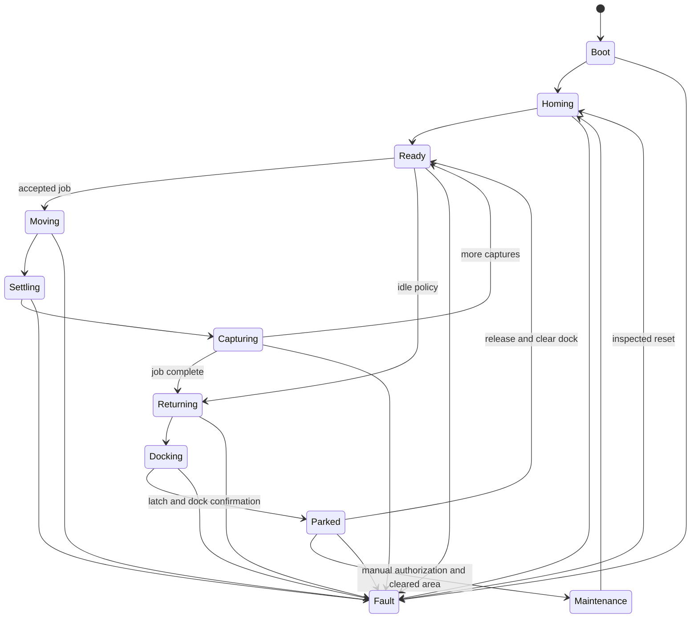

# Interfaces and operating states

## Interface policy

Every interface must name its endpoints, owner, revision, normal range, startup state, failure detection, isolation method, and acceptance test. Connector color alone is not an interface definition.

## Physical interfaces

| Interface | Endpoint A | Endpoint B | Owner |
| --- | --- | --- | --- |
| Structural ground reaction | Soil / anchor | Corner post and outward guy | Site installation and corner station |
| Line routing | Corner pulley tangent | Winch drum tangent | Corner station and winch |
| Positioning load | Four line terminations | Camera-pod spider | Positioning lines and camera pod |
| Dock capture | Pod docking stud | Funnel, locating socket, and latch | Dock |
| Dock support | Dock arm | Docked corner station | Dock and corner station |
| Service mount | Winch frame | Corner-station pole face | Winch |

Exact interface drawings, tolerances, fasteners, and inspection points belong in the owning assembly revisions.

## Electrical and signal interfaces

- Fixed mains enters only the control cabinet through rated isolation and protection.
- Two baseline 48 V/350 W supplies feed fused low-voltage branches.
- Each pole receives a separately protected 48 V and return branch for its CL57Y-V20 driver.
- Each pole receives one outdoor control cable for STEP/DIR and returns, plus local home/reference wiring as designed.
- The powered winch passes 48 V through a rated slip ring and two conductors in the hybrid line.
- The pod converts 48 V to 5 V near the load and buffers short transients with approximately 1000 µF as a starting value.
- The edge service communicates locally with the Pico and pod; protocol, authentication, timeout, replay, and compatibility rules remain to be specified.

The repository's V1 Pico assignment is:

| Axis | STEP | DIR |
| --- | --- | --- |
| A | GP2 | GP3 |
| B | GP4 | GP5 |
| C | GP6 | GP7 |
| D | GP8 | GP9 |

The V1 wiring baseline routes STEP/ground on the orange pair and DIR/ground on the green pair of each outdoor Cat5e cable, with blue reserved for enable/alarm and brown spare. This is a **baseline wiring concept**, not long-run signal-integrity evidence.

## Proposed operating states

The current repository baseline describes sequences but not a complete formal state model. The following state names are proposed for implementation and simulation:

### State invariants

- `Moving`: gimbal remains at its safe motion pose; no normal autofocus or capture begins.
- `Settling`: Skycam trajectory is stopped; the gimbal reaches its target and waits a measured interval.
- `Capturing`: camera autofocus and capture are allowed only after settling.
- `Docking`: speed is reduced and mechanical capture is not inferred from coordinates alone.
- `Parked`: structural latch engagement and accepted dock confirmation are required.
- `Maintenance`: manually initiated only after the area is cleared; automatic logic cannot lower the pod into head space.
- `Fault`: no new normal motion is accepted; permitted recovery actions depend on the detected fault and available energy.

## Docking baseline

1. Move to PRE-DOCK approximately 0.3–0.5 m from the nest.
2. Reduce speed, initially targeting approximately 30–50 mm/s.
3. Approach while maintaining positive tension.
4. Let the funnel center the docking stud.
5. Continue until the passive latch captures it.
6. Confirm the `DOCKED` signal using a specified debounce and plausibility rule.
7. Enter `Parked` and retain only the tension needed to keep every accessible line above the accepted height.

Departure establishes normal operating tension, releases the latch, verifies release, clears the funnel, and only then resumes normal motion.

## Failure and timeout expectations

Every command must have a deadline and defined response to:

- stale or incompatible configuration;
- lost edge-to-MCU or edge-to-pod communication;
- driver alarm or encoder following error;
- home, limit, or dock sensor disagreement;
- pod undervoltage or service reset;
- failed autofocus/capture/upload;
- motion that exceeds position, time, speed, force, or tension expectations;
- loss of cloud or Internet access;
- complete or partial power loss.

The current baseline does not yet define adequate total-power-loss line-clearance behavior. This is a safety gap, not an implementation detail.

## Acceptance criteria

- State and interface schemas are versioned and tested with invalid, delayed, duplicated, and interrupted messages.
- The motion controller rejects trajectories outside its locally loaded safe envelope.
- Cloud loss does not prevent local completion, abort, docking, or fault handling.
- Dock coordinates alone can never assert `Parked`.
- Maintenance entry is authenticated or physically controlled and requires an explicitly cleared work area.
- Hardware and simulation use the same state names, units, configuration schema, and reference scenarios.

## Open questions

- Which subsystem has final authority to de-energize each actuator?
- Is the dock sensor redundant or cross-checked with motor/tension evidence?
- How is latch release actuated and proven clear?
- Which alarm and enable signals are carried on the reserved control pairs?
- What is the safe response to a single-line, driver, encoder, or powered-line failure?
