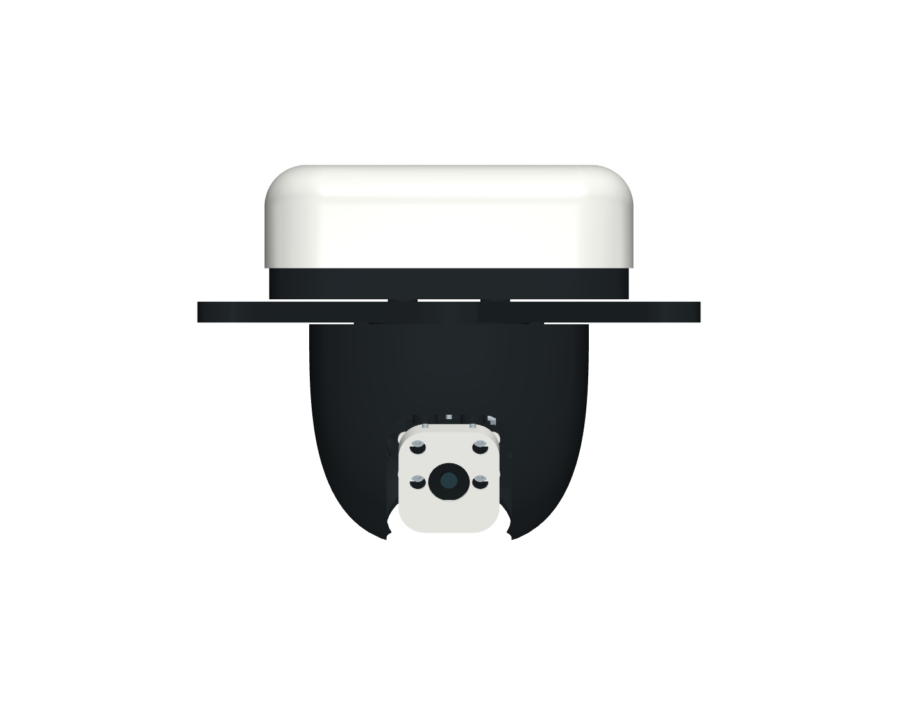

# Continuous payload underside CAD check — 8 October 2026

This inspection record retains the model IDs, filenames and hashes observed at the recorded date. The [model alias map](../../model-aliases.json) maps earlier `payload-*` names to current `camera-pod-*` names; this naming change does not establish new physical evidence.

This is the 8 October snapshot with cradle r0.1.0. The [reinforced cradle record](camera-pod-camera-cradle-check.md) covers its r0.1.1 replacement and current nominal assembly/service checks.

## Scope and status

The preferred [integrated enclosure](camera-pod-enclosure.md) uses one printed black outer head r0.1.3 and a compact internal carrier r0.1.1. The integrated camera cradle and short pivot support are both r0.1.0. The tilt axis moves from Y=0, Z=−59 to Y=3, Z=−45; the tilt servo lies sideways and its drive moves 2 mm inward. The shoulder-to-chin taper is retained in a smaller shell. The entire head pans with the camera, enclosing the tilt servo, horn and pivot brackets behind a close camera opening. It replaces the fixed fairing, separate servo boot and dry pan yoke in this variant. The upper white hood r0.2.1, tray r0.2.3, integrated deck r0.1.0 and lens-centred camera face r0.1.1 complete the configuration. All models remain **concept-unvalidated**; [ADR-0009](../../../docs/decisions/0009-compact-integrated-camera-pod.md) records the design direction accepted on merge; physical validation remains pending.

The [machine-readable record](camera-pod-enclosure-check.json) identifies exact model revisions, mesh SHA256 values, checker sources, staged service paths and mass calculations. The [historical r0.1.0 record](camera-pod-enclosure-check-r0.1.0.md) and [JSON](camera-pod-enclosure-check-r0.1.0.json) preserve the earlier elongated enclosure. Supplier-dependent servo, horn, converter, connector and fastener dimensions remain nominal.



These are registered CAD meshes with nominal bought-part references. The [underside](../../../docs/assemblies/camera-pod/enclosure/compact-underside-cad.png), [bottom](../../../docs/assemblies/camera-pod/enclosure/compact-bottom-cad.png) and [pan 90° underside](../../../docs/assemblies/camera-pod/enclosure/compact-underside-pan90-cad.png) show the revised operating surface. The [hero](../../../docs/assemblies/camera-pod/enclosure/assembled-cad.png), [neutral](../../../docs/assemblies/camera-pod/enclosure/compact-neutral-cad.png), [eye-aligned](../../../docs/assemblies/camera-pod/enclosure/compact-eye-aligned-cad.png) and [electronics](../../../docs/assemblies/camera-pod/enclosure/compact-electronics-cad.png) views share the same geometry. Product front/hero/eye views use tilt 70°; the booklet line art uses 55° and the neutral GLB points down. The concept artwork is appearance intent, not fabricated-part evidence.

## Results

| Check | Result |
| --- | --- |
| Repository compilation | All 86 current registered models compiled locally with pinned OpenSCAD 2021.01 on 8 October 2026; registry, includes, revisions and BOM mappings pass. This is the local source snapshot based on commit 6d259c8, with exact geometry hashes in the machine-readable record. |
| Exported meshes | 13 fabrication meshes including the uninstalled coupon, 30 hardware/reference meshes and one rigid power-route proxy. All 44 are single connected, watertight, consistently wound solids with positive volume. |
| Taper | 1566 horizontal sections of the actual STL narrow downward in both axes, with zero failures at 0.001 mm numerical tolerance. |
| Neck seam | 41 actual STL sections through Z=-6.1…-4.1 have a minimum 1.444 mm radial gap. Each section bounds all pan angles using the closest fixed-skin point and largest moving radius. A 4% oversized moving-neck control detects interference. This remains sampled in height. |
| One-piece housing | The outer head is one connected printable solid; the removable carrier is a separate internal print. |
| Neutral assembly | Zero unintended intersections above the unchanged 0.005 mm³ numerical tolerance. |
| Sampled travel | 555 poses, pan −90…90° and tilt 0…70° in 5° steps; zero cross-group interference. This is sampled, not continuous proof. |
| Stop controls | Pan −96/+96° and tilt −6/+76° produce the intended stop contacts. |
| Assembly and service | 30 paths with zero failures, including full camera bolt/washer insertion, captive head hardware loading, outer-body removal, camera removal and carrier release. Removed parts and intentional OEM engagements are recorded explicitly. |
| Tool envelopes | 22 probes clear at their documented stages, including 80 mm head-screw and 65 mm pan-centre shafts. Four rear-camera probes use a 5.3 mm hollow socket and 6 mm local length. Full driver handles, wrench turning and side-wrench engagement under the Pi remain unrepresented. |
| Wiring openings | 4 local opening proxies and both through-drain envelopes clear. CSI/servo paths do not establish complete flexible routing. |
| Fixed power route | Ø6 mm rigid proxy clears 111 poses, pan every 5° at tilt 0/35/70°. It stays outside the moving head below the spider. The misplaced central-drop control still detects the internal carrier. |
| Optics | The 66° × 41° viewing pyramid, 80 mm deep, clears 15 poses: pan −90/−45/0/45/90°, tilt 0/35/70°. |
| Proud-head control | A deliberately proud retainer screw still intersects the pan mount. |
| BOM/docs | Canonical/generated BOM consistency and local Markdown links pass after rebasing onto the current main; 227 procurement incompleteness warnings remain. |

No numerical tolerance or general collision exclusion was relaxed. The original servo spline/horn and OEM screw/thread engagements are explicit exceptions; their use during removal is limited to those exact pairs. The dry bench remains a separate unchanged geometry selection with its [own earlier check record](camera-pod-geometry-check.md).

## Enclosure and assembly

The upper shell remains 124 × 118 mm and centred at X=0 above the camera. Tray r0.2.3 retains its 120.8 × 114.8 mm outline, floor Z=13.2–14.4, upper lip and all original attachment axes. Its underside rolls into a nominal Ø103 mm throat at Z=-6.1. Four 23.2 mm open-bottom reliefs clear the unchanged 22 mm spider arms, allowing the tray to lift off the retained neutral gimbal after the upper hardware and harness are removed. Recessed cover-screw and CSI access, a 9 × 24 mm rear power breakout at Z=-3.5–5.5 and both through-drains preserve service and routing. The skin remains one connected solid.

Head r0.1.3 has a circular Ø100 mm open neck at Z=-4.1, blending over 28 mm into the existing taper. Its actual mesh measures 100 × 100 × 72.545 mm and ends at Z=-76.6453; the lower chin, optical opening and four carrier attachment axes remain unchanged. The nominal seam is 1.5 mm radial with 2 mm axial overlap; the actual STL section check above includes the polygonal throat. Both parts are separate and removable, with the head turning inside the fixed shoulder. Reprint the tray and outer head together. The head still leaves 0.6 mm below the spider. The original smaller r0.1.2 shoulder dimensions and 42.48% envelope comparison belong to the preceding revision, retained in Git history and ADR-0009.

The narrow front/underside opening accommodates the tilting camera while enclosing the side mechanism. The former internal rear camera cowl and its four extra nuts are omitted. Four M2 × 12 screws, eight washers and four nuts retain the unchanged camera/white-hood stack; M3 remains at the existing opposite pivot. A separate rear cover is not included in this selected geometry, while weather and flexible-ribbon protection still require physical checks. The 34 × 36 mm white camera face has a lens-centred Ø14 mm opening and Ø5.4 mm screw/washer passages. The approximately 0.8 mm webs beside its eye require print inspection.

Four M2 × 10 bolts and eight washers clamp the carrier to the outer head at X=±8, Y=±30.5. Four plain nuts and lower washers load sideways from inside into the head's captive pockets before the mechanism enters. The carrier has complete washer lands on both front and rear tabs. Assemble the servo and camera mechanism outside the body; attach the pan horn centre screw before the camera blocks its long access route. Raise the body over the neutral assembly and fasten it from above before the upper tray and electronics obstruct access.

For service, disconnect power/leads and support the spider and pan mount on a bench fixture. Remove the upper stack to reach the four head screws, then lower the one-piece body with its captive hardware while retaining the complete carrier. Remove the four rear camera nuts and washers and lower the camera, white hood and front fasteners, then reach the pan centre screw through the retained open cradle. The short opposite pivot support slides inward from the right during assembly. Capture and fasten the tilt horn in the separate cradle before servo engagement; the sideways servo obstructs a retainer driver afterwards. The paths assume disconnected leads or measured slack; they do not prove removal around attached flexible cables.

Preassemble the Pi's underside washers/nuts before lowering its deck into the tray. The Pi covers the two left M4 frame nuts, so actual side-wrench engagement and turning remain an open received-tool check. A supported fixture is essential while shared upper-stack/frame fasteners are removed; the CAD paths do not establish a suspended service procedure.

The fixed power proxy centreline is `[10,40,24] → [10,40,1] → [10,60,1] → [10,60,-61] → [10,70,-61]`. It turns outward at Z=1 through the fixed shoulder’s rear breakout and above the rotating head, then descends at Y=60 outside the pan sweep. These waypoints describe a rigid clearance volume, not sharp bends to impose on a cable. Actual bend radius, sleeves, drip loops, restraint and the separate moving CSI/servo loops require inspection.

## Solid-volume calculation

Mesh volume × **1.27 g/cm³ PETG density**, for **16 installed prints**, is **253.753 g**. This is a full-solid CAD calculation, not slicer output or measured mass.

| Installed part | Solid volume (cm³) | Full-solid PETG (g) |
| --- | ---: | ---: |
| `spider` | 66.232 | 84.115 |
| `deck` | 13.442 | 17.071 |
| `spider-spacer-0` | 0.875 | 1.112 |
| `spider-spacer-1` | 0.875 | 1.112 |
| `spider-spacer-2` | 0.875 | 1.112 |
| `spider-spacer-3` | 0.875 | 1.112 |
| `pan-mount` | 8.299 | 10.540 |
| `pan-yoke` | 8.459 | 10.743 |
| `gimbal-head` | 22.087 | 28.051 |
| `tilt-pivot-support` | 1.089 | 1.383 |
| `camera-cradle` | 3.191 | 4.053 |
| `camera-hood` | 4.588 | 5.827 |
| `pan-horn-retainer` | 0.545 | 0.692 |
| `tilt-horn-retainer` | 0.545 | 0.692 |
| `enclosure-base` | 31.381 | 39.854 |
| `rain-hood` | 36.443 | 46.283 |
| **Total** | **199.805** | **253.753** |

This is 8.885 g above the preceding 244.868 g full-solid estimate: approximately 8.524 g in the fixed shoulder and 0.361 g in the moving head. These differences are CAD calculations, not sliced mass.

The print calculation alone exceeds the **170 g complete-pod ceiling**. Slice and weigh the complete configured assembly before assessing flying mass. The outer head now moves in pan, adding load and inertia to the servo; torque, settling, current, heating and cable drag require separate physical checks. The earlier owner-reported 103.05 g sliced number has no confirmed quantity/settings basis for this revision and is not extrapolated.

Neutral modeled dimensions are approximately **169.08 × 169.08 × 126.15 mm**. Strength, balance, docking, received-part fit, cable fatigue, electrical/thermal behavior and ordinary-rain/splash performance remain unvalidated. No ingress rating or suspended-use approval follows from these CAD checks.

## Reproduction

Use Node ≥24, pinned pnpm, OpenSCAD 2021.01 and the [booklet workflow/dependencies](../../../scripts/camera-pod-booklet/README.md). Generated meshes and packs stay in ignored `hardware/generated/`; checked-in earlier PDFs/ZIPs are labeled historical snapshots.

```sh
pnpm cad:check -- --require-openscad
pnpm bom:check
pnpm docs:check
python3 scripts/camera-pod-booklet/build.py --enclosure --output hardware/generated/payload-continuous-underside-final
python3 scripts/check-booklet.py hardware/generated/payload-continuous-underside-final --variant enclosure
git diff --check
```

The enclosure build emits booklet revision 5, the current STL/source pack, neutral GLB, product previews and exact figure transforms. Do not combine the older dry, fixed-fairing or servo-boot alternatives with this print inventory.
