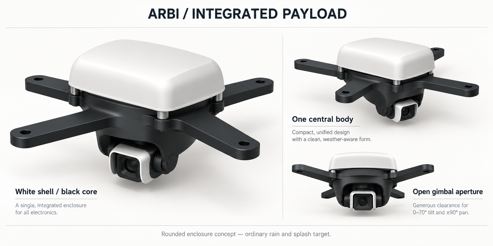
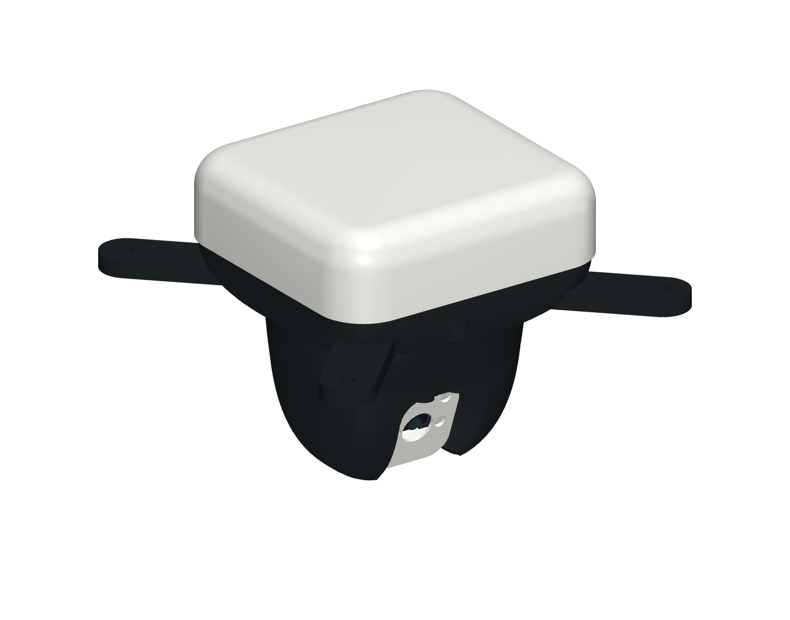

# Compact integrated payload rain enclosure r0.2.5

This is the compact rounded black/white appearance configuration for the [payload mount family](payload-mounts.md). It is designed to reduce ordinary rain and splash exposure of the fixed Pi/power electronics, both servo bodies, and the camera rear connector. All models remain **concept-unvalidated**. The shell has downward openings, drainage, an open gimbal aperture and exposed moving interfaces; it has no ingress rating. It does not change the [weather operating policy](../../../docs/operations/weather-parking-and-maintenance.md), dock shelter requirement or physical flight acceptance gates.

The selected illustration records the appearance direction: one rounded white upper body, a black lower core, and a small white moving optical surround. [ADR-0009](../../../docs/decisions/0009-compact-integrated-payload.md) records the compact packaging decision and its preserved interfaces, accepted as the design direction on merge with physical validation pending. The illustration is an appearance reference, not a dimensioned CAD render or proof of clearance. The [earlier alternatives](../../../docs/assemblies/camera-pod/enclosure/concepts.png) are retained for design history. The canonical fixed-shell geometry is [payload-enclosure.scad](../../lib/payload-enclosure.scad); [payload-integrated-head.scad](../../lib/payload-integrated-head.scad) defines the one-piece moving outer head, and [payload-integrated-gimbal.scad](../../lib/payload-integrated-gimbal.scad) defines its compact internal carrier, camera cradle and opposite pivot support. [payload-rain-assembly.scad](payload-rain-assembly.scad) r0.2.5 is their assembled reference. The fixed electronics use the separate [integrated deck](../../lib/payload-integrated-deck.scad).

The [underside](../../../docs/assemblies/camera-pod/enclosure/compact-underside-cad.png), [bottom](../../../docs/assemblies/camera-pod/enclosure/compact-bottom-cad.png) and [pan 90° underside](../../../docs/assemblies/camera-pod/enclosure/compact-underside-pan90-cad.png) views show the tray/head clearance seam during operation. The actual CAD preview and [front view](../../../docs/assemblies/camera-pod/enclosure/compact-front-cad.png) show the compact configuration at pan 0°, tilt 70°. The [neutral](../../../docs/assemblies/camera-pod/enclosure/compact-neutral-cad.png) and [open electronics](../../../docs/assemblies/camera-pod/enclosure/compact-electronics-cad.png) views use the same meshes at tilt 0°. The generated `product-eye-aligned` diagnostic looks along the lens axis at tilt 70° with the full assembly retained; `preview-manifest.json` records each view's pose, viewing direction and part transforms. The booklet's line-art covered view remains at tilt 55°. The [check record](payload-enclosure-check.md) and [machine-readable results](payload-enclosure-check.json) identify the inspected revisions. The [historical record](payload-enclosure-check-r0.1.0.md) preserves the earlier elongated enclosure.

## Configuration and print quantities

Choose either the dry bench arrangement or the compact enclosure arrangement below. **Do not install the dry deck, cover, optical hood, pan yoke, cradle or pivot support, or the earlier fixed fairing, servo boot or rear camera cowl, in this compact kit.** Its one-piece outer head surrounds a separate compact carrier; both move in pan. The new cradle and pivot support place the camera higher inside that head. The white optical surround retains its existing geometry and camera mounting pattern. The original `camera-pod-*` concept gimbal is a separate family.

| Model | Revision | Per enclosed pod | Suggested colour | Change from the dry bench set |
| --- | --- | ---: | --- | --- |
| `camera-pod-spider` | 0.1.0 | 1 | Black | Reuse; no geometry change |
| `payload-integrated-deck` | 0.1.0 | 1 | Black | New compact carrier; replaces dry deck |
| `payload-spider-spacer` | 0.1.0 | 4 | Black | Reuse |
| `payload-pan-servo-mount` | 0.1.0 | 1 | Black | Reuse |
| `payload-integrated-gimbal-carrier` | 0.1.1 | 1 | Black | Reprint compact carrier for the horizontal tilt servo |
| `payload-integrated-gimbal-head` | 0.1.3 | 1 | Black | Reprint circular neck blending into the tapered outer housing |
| `payload-integrated-camera-cradle` | 0.1.0 | 1 | Black | New compact cradle; replaces the dry cradle |
| `payload-integrated-tilt-pivot-support` | 0.1.0 | 1 | Black | New compact pivot support; replaces the dry support |
| `payload-horn-retainer` | 0.1.0 | 2 | Black | Reuse |
| `payload-integrated-camera-hood` | 0.1.1 | 1 | White | New rounded optical surround; replaces dry hood |
| `payload-rain-hood` | 0.2.1 | 1 | White | Reprint compact shell with broad rounded crown |
| `payload-enclosure-base` | 0.2.3 | 1 | Black | Reprint rolled underside shoulder with a circular clearance throat |

This is 16 installed printed pieces from 12 installed model types. The 13th exported fabrication model, `payload-servo-fit-coupon`, is an optional test print and is not installed. `payload-rain-assembly` and `camera-pod-assembly` are reference CSGs, not print parts. The stable BOM owners remain [camera-pod-chassis](../../../bom/generated/parts/camera-pod-chassis.md) and [camera-gimbal](../../../bom/generated/parts/camera-gimbal.md); their fabrication-source lists retain alternatives, not a requirement to print every listed source.

When upgrading from the earlier large tapered-head configuration, fit the compact carrier and integrated cradle/pivot support listed above. Remove the separate rear camera cowl and its four secondary nuts. Return to four M2 × 12 camera screws, retaining four primary M2 nuts and eight washers. The underside refinement replaces tray r0.2.2 with r0.2.3 and outer head r0.1.2 with r0.1.3 as a matched pair. The white hood, electronics deck, optical hood, carrier, cradle, pivot support and remaining compatible prints keep their revisions. The assembled references are `payload-rain-assembly` r0.2.5 and `camera-pod-assembly` r0.3.5.

The new shell walls start at 1.2 mm. ASA remains the preferred exposed-release material and PETG is a prototype starting point; neither material/colour choice establishes UV resistance, creep performance, water resistance or thermal acceptance. Slice the complete chosen quantities with the intended nozzle, walls, layers and supports, inspect thin walls and bridging, and weigh the printed assembly. Keep support scars away from mating lips, nut pockets, horn pockets and pivot bores. Print orientation and removable-support access need slicer review before manufacture.

## Fixed body and attachment interfaces

Coordinates below use millimetres in the spider-centred assembly frame: Z points toward the dock and the spider line plane is Z=0. Moving-part coordinates and staged service use neutral pan=0°, tilt=0° unless a check explicitly states another pose. Nominal rigid CAD checks do not establish received-part or flexible-harness fitting.

- Upper hood: 124 × 118 mm plan envelope centred at X=0, Y=0, with 20 mm plan corner radius, lower edge Z=14.8 and roof Z=49.5. A 14 mm rolled shoulder replaces the earlier straight chamfer. Its roof has no intended screw openings.
- Compact electronics: Pi centre [-22, 0], with its unchanged 58 × 49 mm mounting pitch; converter centre [32, 0], turned 90° in plan; capacitor centre [32, -34]. The fixed frame interfaces, deck Z=17.5–20.5 and Pi board underside Z=30.5 remain unchanged. Converter and capacitor envelopes are provisional, not selected-hardware fits.
- Upper rain tray: 120.8 × 114.8 mm plan envelope; floor Z=13.2–14.4. Its raised lip overlaps inside the fixed upper hood. Revision 0.2.3 replaces the exposed flat underside/skirt with a rolled shoulder ending at Z=-6.1 in a nominal Ø103 mm circular throat. The moving head has a Ø100 mm neck at Z=-4.1, giving 2 mm axial overlap and 1.5 mm nominal radial clearance. The actual faceted STL clearance is recorded in the geometry check. Four open-bottom 23.2 mm arm reliefs preserve the unchanged spider and upward tray removal. Recessed screw access, CSI access, the rear power breakout and both drains remain open. The new moving head attaches to its internal carrier instead of the tray.
- Hood, compact deck and tray share four M3 axes at X=-22 and 22, Y=-46 and 46, in the fore/aft gaps between the spider arms so a driver can approach from below. Four M3 × 35 bolts enter from underneath, each with one washer at Z=12.7, and engage plain M3 nuts captured in side-loaded pockets at Z=44. Nominal screw tips reach Z=47.7; the represented 2.4 mm nut leaves 1.3 mm tip protrusion. Roof clearance must be evaluated at each screw and nut against the curved shoulder, not the maximum centre roof height. The nut slots face inward for installation with the hood off. No threads depend on printed plastic. Check actual washer, nut and bolt dimensions, nut insertion access, thread engagement and roof clearance before tightening.
- Moving lower head: r0.1.3 blends the circular Ø100 mm neck into the existing tapered lower profile over the first 28 mm below Z=-4.1. The front/underside camera opening, four carrier clamp axes and lower chin geometry remain unchanged. Its neck sits inside the fixed shoulder so the underside reads as one continuous charcoal body with a narrow clearance seam. Both parts remain separate and removable. The [geometry record](payload-enclosure-check.md) owns actual mesh bounds, taper and seam clearance. The head and carrier rotate together through nominal pan ±90°; the camera tilts inside the front/underside opening.
- Compact gimbal: tilt axis Y=3, Z=-45, placing the camera 14 mm higher than the preceding arrangement. The tilt servo turns 90° about X into a horizontal orientation and moves 2 mm inboard; the driven horn interface is at X=-19.8. The integrated cradle, carrier and opposite pivot support implement this arrangement. Camera screws remain M2; the existing M3 opposite pivot is retained.
- The tray fits around the existing four spider spacers and the relocated Pi fastener axes X=-51 and 7, Y=±24.5. Frame, Pi, servo ear, horn retainer and pivot fastener sizes remain as listed in [payload-mounts.md](payload-mounts.md); use the compact placement above for its Pi and cover axes. The shell does not create a new tensile load path or resolve the docking stud interface.

## Moving head, assembly and service

The one-piece outer `payload-integrated-gimbal-head` r0.1.3 and internal `payload-integrated-gimbal-carrier` r0.1.1 are separate prints. Four M2 × 10 screws, eight M2 washers and four M2 nuts join them at X=±8, Y=±30.5. Screws enter downward from Z=-28.9, with upper washers at Z=-29.2–-28.9. Each Ø8.2 head boss extends from Z=-37.5 to -31.7, retaining a 3 mm clamp land above the lower washer. Load the lower washer into Z=-35–-34.7 and the plain nut into its Z=-36.8–-35 pocket from the inward-facing channel before the carrier enters. The nut is captive in the printed pocket; no hidden wrench is intended. Inspect pocket fit, washer seating, thread engagement and printed clamp lands before tightening.

The nominal staged sequence is:

1. Secure the spider and fixed pan mount independently on a bench fixture. Populate the separate carrier outside the outer head. Attach the carrier to the stock pan horn and fit the pan OEM centre screw before installing the camera. On the bench, fasten the stock tilt horn and retainer to the separate cradle before engaging the mounted tilt servo; the servo case blocks the rear retainer driver after spline engagement. Seat the cradle on the servo, secure the tilt OEM centre screw, then slide the opposite pivot support inward along -X from a position 12 mm to its right. Secure the support and existing M3 pivot before fitting the camera and optical hood. An upward support-installation path collides with the compact geometry.
2. Preload all four lower washer/nut pairs into the head. At neutral pan/tilt, raise the head over the complete gimbal, then fit its four screws and upper washers from above. Complete these clamps before the upper tray and electronics stack obstruct access.
3. Fit the tray, deck and fixed electronics. Fit Pi underside washers/nuts before lowering the deck. The two left M4 frame nuts require side-wrench access beneath the Pi; short-driver checks do not prove that wrench or handle clearance. Fit the hood's captive M3 nuts, route the harness and close the upper hood last.
4. For service, isolate power and release or feed the harness. With the spider and fixed pan mount independently supported, remove the upper hood, electronics/deck/tray and relevant frame stacks to expose the head clamps. At neutral, remove the four head screws and upper washers, then lower the head 100 mm with its captive lower washers/nuts while the carrier stays supported. The nominal top approach uses an 80 mm straight driver; inspect the actual handle and fixture.
5. With the head off, remove the camera's four rear nuts/back washers and lower the camera, white hood and front fasteners 30 mm. The open cradle then admits the nominal 65 mm OEM driver before the centre screw and supported carrier can be removed. The compact kit has no separate cowl-removal stage.

The [service record](payload-enclosure-check.md) owns the tested staged paths and their prerequisites. Reverse the checked sequence for assembly. A clear rigid path does not prove removal around attached leads or establish a suitable support fixture. Inspect cable slack and disconnect the isolated harness where necessary; do not pull the enclosure against retained wiring. The upper lip, moving neck and optical opening are rain-shield details, not seals.

The compact camera stack uses **four M2 × 12 screws, eight M2 washers and four primary M2 nuts**. It omits the earlier separate rear cowl, M2 × 18 screws and four secondary nuts. Measure screw-tip clearance, thread engagement and washer seating at the optical hood/board/cradle stack; avoid loading the camera PCB or pinching its CSI connector. The outer head now provides the proposed rear-camera shielding. Inspect the rear connector, ribbon loops and wet paths with the complete moving assembly; removing the separate cowl requires new physical rain/splash evidence.

The white `payload-integrated-camera-hood` r0.1.1 has a 34 × 36 mm eye outline with 9 mm corner radius, centred on the lens at local Y=-2.469. Its front face spans local Z=2–3.4 and has a Ø14 mm circular optical opening. The rear cavity remains 26.6 × 25.6 mm, and the four M2 camera axes remain unchanged. Four Ø5.4 mm tunnels admit each complete M2 screw head and Ø5 mm front washer before the rear nuts are fitted. The approximately 0.8 mm web between the nearest fastener tunnel and the Ø14 mm lens opening requires print and physical inspection. It moves with the camera and is fitted in place of the dry hood. Confirm the optical-volume check and front-driver access with this outline.

Nominal software travel remains pan ±90° and tilt 0–70°; the mechanical range used for checks is pan ±95° and tilt -5–75°. Establish physical limits inside the measured cable and collision envelope. The outer head now adds mass and inertia to the pan group. Recheck servo torque, horn/fastener loads, current, backlash and settling with the complete printed assembly; a clear CAD sweep does not establish those physical limits.

## Harness entry, exit and strain relief

The base provides dedicated downward outlets with collars recessed above its rounded shoulder. A 9 × 24 mm rear breakout at [10, 58], Z=-3.5–5.5 lets the incoming lead turn outward along its existing nominal route. These dimensions are nominal passage dimensions, not approved connector specifications:

| Route | Base opening and XY centre | Internal path / moving exit | Remaining measurement |
| --- | --- | --- | --- |
| Powered line to fixed converter | Ø8 mm at [10, 40] | Enter from below, turn outboard above the pan stops, form an exterior drip loop, sleeve the conductors, and secure the sleeve to the deck's separate power tie pad | Received wire/insulation diameter, bend radius, connector envelope and dielectric separation |
| Pi CSI to camera | 24 × 8 mm at [0, -48] | Aligned compact-deck passage is 18.8 × 4.8 mm; route the nominal 16 × 0.3 mm ribbon through its centre, then use separate relaxed pan/tilt loops inside the outer head to the camera connector | Actual ribbon width/thickness, end stiffener/connector size, permitted bend radius and fatigue |
| Fixed power/control to servos | 9 × 6 mm at [-40, -15] | Branch to the fixed pan servo and a separate relaxed loop to the tilt servo inside the moving head | Actual bundled leads, servo plug and case lead-exit position |

Keep mating electrical connectors inside the upper body where their measured dimensions permit; do not assume a connector fits through the narrowest slot. Route an unattached ribbon through the passages before closing its connector latches, or enlarge the parametric passage after measuring the received end. The shell does not provide glands or compressed cable seals.

Route the sleeved incoming lead clear of the moving head and full gimbal sweep. The current nominal Ø6 mm proxy follows `[10,40,24] → [10,40,1] → [10,60,1] → [10,60,-61] → [10,70,-61]`; the [geometry record](payload-enclosure-check.md) owns its tested poses and collision control. These waypoints are a rigid proxy, not sharp bends to impose on a real lead. Smooth turns to the received wire's permitted bend radius, provide service slack and inspect the actual route. Earlier fixed-fairing routes do not apply.

Give the CSI ribbon and tilt-servo lead **separate relaxed pan and tilt loops**. Anchor the fixed ends on the deck, provide a pan loop to the internal carrier, then a tilt loop to the camera; keep them clear of horn pockets, servo shafts, hard stops, the optical opening and nut pockets. Use soft wraps rather than a sharp tie pressing directly on the ribbon. Verify the whole movement range with the intended harness installed, including reverse moves and service removal. Minimum bend radii and allowed twist remain received-part questions; a straight nominal routing proxy cannot establish fatigue life.

The positioning line requires an **independent tensile termination** on the spider/line interface. Conductors, connectors, deck ties and enclosure collars must not carry line tension. Downward entries and drip loops must not channel water into the converter, servo case or camera connector. Both original 6 × 2 mm downward drain slots continue through the rolled shoulder. The tray has these slots at [-30, -56] and [20, -56], straddling the lip's inner edge, and the gimbal remains open underneath; inspect that supports, debris and wiring do not block them. Their location is a drainage provision, not proof that rain cannot enter through them.

## Evidence and acceptance boundary

The [dry bench record](payload-geometry-check.md) describes the separate dry configuration; the [dated 28 September record](payload-geometry-check-2026-09-28.md) preserves its earlier evidence. The current [enclosure record](payload-enclosure-check.md) and [machine-readable results](payload-enclosure-check.json) identify the compact-gimbal revisions. The fresh nominal build passes 555 motion poses, all four overtravel checks, 1,566 taper sections, 41 neck-seam sections, 30 staged service paths, 22 tool envelopes, six port/drain envelopes, 15 optical poses and 111 incoming-lead poses. Oversized-neck, deliberately misplaced-lead and proud-servo-head collision controls are detected. These are sampled rigid CAD results, not physical assembly or operation evidence.

The 16 installed prints total **253.753 g as a solid-volume PETG estimate at 1.27 g/cm³**, including **28.051 g for the outer head**. This excludes hardware and electronics and is not sliced or measured mass. Generate the [booklet and source/mesh pack](../../../scripts/payload-booklet/README.md) into `hardware/generated/payload-compact-gimbal` from these revisions. Its 44 meshes comprise 13 fabrication models, 30 nominal hardware references and one routing proxy; the optional coupon is not installed. Earlier PDFs/ZIPs remain historical snapshots.

The owner reported **103.05 g for the earlier sliced printed parts**. Installed quantities, print settings, supports and actual printed mass have not been independently confirmed. Do not add this number to a new mesh estimate or present it as a measured flying assembly. The complete configured pod still targets **100–120 g**, with a **170 g hard design ceiling**. Weigh all installed prints, Pi, camera, servos, converter, capacitor, horns, fasteners, ribbon, wiring, insulation and any retention before assessing that ceiling.

Before claiming ordinary-rain/splash protection, record the tested part revisions, material, print settings, fitted hardware, angles, duration, water direction/intensity and inspection method. Check wet paths at the lip, nut pockets, spider passages, servo spline, lead exits, camera opening and drain slots. Record drainage and post-exposure drying/condensation. The target is a bounded rain/splash prototype; immersion, pressure washing and an ingress rating are outside this proposal.

Thermal acceptance needs temperatures with the upper shell fitted, at representative ambient conditions and camera/Wi-Fi/servo/converter loads, plus sheltered dock heat soak. White upper surfaces are an appearance/material choice and do not prove sufficient cooling. Physical fit, cable fatigue, electrical isolation, fastener retention, servo torque/settling, flying mass, balance, load capacity, dock clearance and rain/thermal behavior remain separate unverified gates after source checks.
