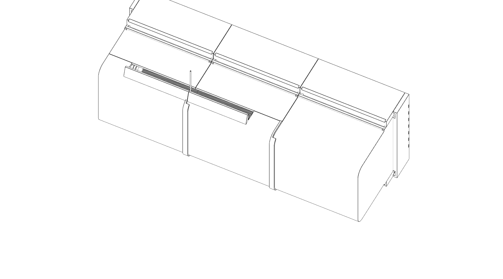
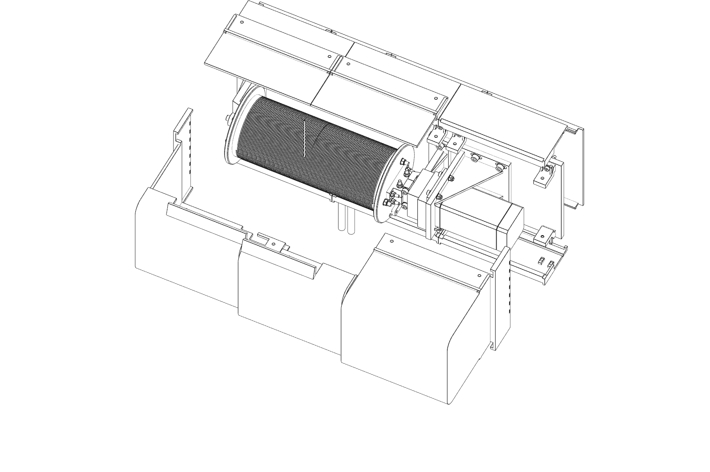
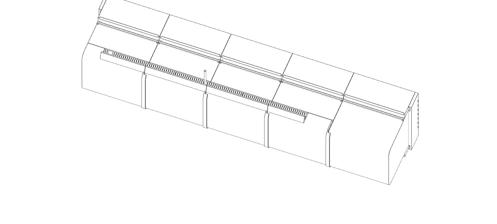
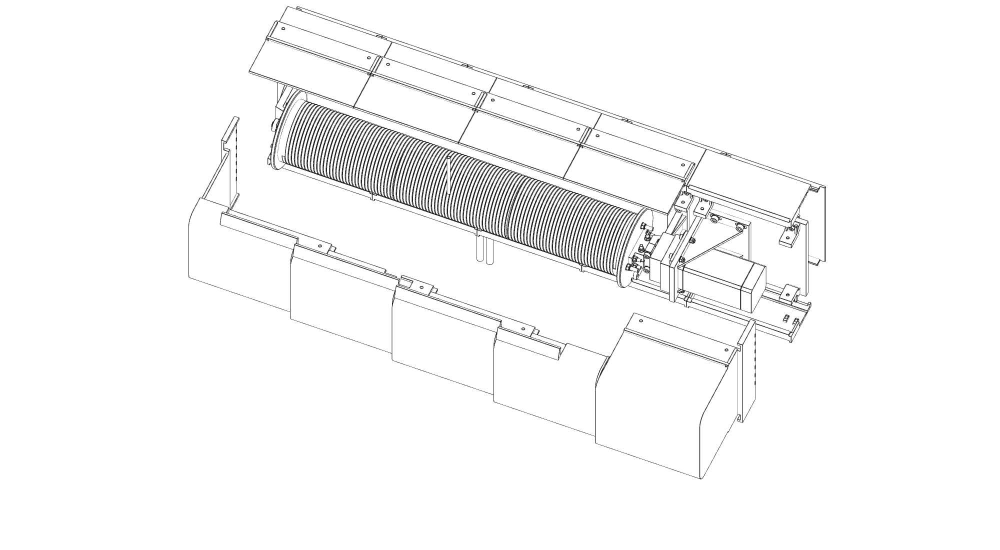

# Modular full-winch cover

Status: **concept-unvalidated**, kit **r0.3.0**. Bottom-layout replacements are passive left/right and powered right r0.3.0, a new powered pole middle and lower pole fascias r0.1.0. Other panels, clips and shutters retain r0.2.0; anchor and concealment prints retain r0.1.0. This is a printable
assembly-cover proposal under [ADR-0007](../../../docs/decisions/0007-integrated-product-design.md),
using the [rounded warm-white shell / charcoal core convention](../../../docs/project/industrial-design.md).
It does not establish safe contact protection, an ingress rating or thermal suitability.
The [geometry record](full-cover-check.md) identifies the represented configuration.

The interface proposal and acceptance work are recorded in [issue #91](https://github.com/gredice/arbi/issues/91).

## Actual-mesh previews

These are nominal engineering configurations rendered from the registered STL
files; the [booklet pack](../../../docs/assemblies/winch/booklet/README.md) records
every source mesh and transform. Post mounting is shown +Y up; no field test is implied.

## Compatibility and quantities

Reuse the drum components r0.1.0, bearing lowers/caps and motor stand r0.1.0,
coupling guard r0.1.1, shaft, coupling, collars, spacers and existing fasteners.
For bottom routing, replace passive left/right and powered right at r0.3.0; use the new powered index-1 pole middle and one new lower pole fascia per winch. Reuse the other main panels, shutters, clips and r0.1.0 anchor. Move that anchor to the revised pole-side holes. No drivetrain reprint or changed shaft/bearing/stand pattern is required. **Post mounting changes:** use four 25 mm steel M8 standoffs (nominal 16 mm OD / 9 mm bore) per winch; a flush post mounting is incompatible with the rear hardware and shields. This spacing is a concept interface requiring structural/bolt-bending review before installation. No printed part carries post load. The
cover installs over the existing coupling guard; remove that guard separately
for coupling service. This shell contains the committed winch mechanical assembly
and motor. The CL57Y driver is not represented by that CAD; its near-motor
protected mounting/enclosure remains [corner-station electrical work](../../../docs/assemblies/corner-station/README.md).
No driver, homing or brake interface is added inside this shell.

Modify the existing aluminium base with the **cover drilling variant r0.3.0**.
Blank sizes stay 550 × 180 × 8 mm passive / 880 × 180 × 8 mm powered. The nominal
post-washer envelope is **≤24 mm OD and ≤1.6 mm thick**; the inward clip stems
start at Z=5.8 mm above those washers. Inspect oversized hardware before fitting.
Existing
M6 and M8 holes, bearing height and motor adjustment stay unchanged. A base
without the additional holes cannot accept this kit. Check hole edges, local
strength, corrosion treatment and access behind the installed plate physically.

| Print/model | Passive | Powered | Three passive + one powered |
| --- | ---: | ---: | ---: |
| [Passive left](winch-cover-passive-left.scad) | 1 | 0 | 3 |
| [Passive middle](winch-cover-passive-middle.scad) | 1 | 0 | 3 |
| [Passive right](winch-cover-passive-right.scad) | 1 | 0 | 3 |
| [Powered left](winch-cover-powered-left.scad) | 0 | 1 | 1 |
| [Powered plain middle, index 2](winch-cover-powered-middle.scad) | 0 | 1 | 1 |
| [Powered pole middle, index 1](winch-cover-powered-pole-middle.scad) | 0 | 1 | 1 |
| [Powered transition, index 3](winch-cover-powered-transition.scad) | 0 | 1 | 1 |
| [Powered right](winch-cover-powered-right.scad) | 0 | 1 | 1 |
| [Identical dark base clip](winch-cover-clip.scad) | 12 | 20 | 56 |
| [Fixed-loom anchor](winch-cover-cable-anchor.scad) | 1 | 1 | 4 |
| [Passive payout shutter](winch-cover-passive-shutter.scad) | 2 | 0 | 6 |
| [Powered payout shutter](winch-cover-powered-shutter.scad) | 0 | 4 | 4 |
| Plain variant fascia | 5 | 9 | 24 |
| [Lower pole fascia](winch-cover-passive-pole-fascia.scad), [powered](winch-cover-powered-pole-fascia.scad) | 1 | 1 | 4 |
| Rear-left shield | 1 | 2 | 5 |
| Rear-right shield | 2 | 3 | 9 |
| Common removable bench blank (optional) | 1 | 1 | 4 |
| Added prints total, including bench blanks | 28 | 46 | 130 |

All release entrypoints are registered in [models.json](../../models.json).
The powered transition is a distinct print: the payout opening ends at X=580.3
mm within this panel, and its upper side wall resumes over the bearing/coupling.
Do not substitute a third powered middle panel, whose opening spans its full length.
[winch-cover-assembly.scad](winch-cover-assembly.scad) is a contextual reference,
not a printable combined object. Set `powered=true` for the powered variant and
`exploded=true` for the outward panel-removal illustration. The canonical library
is [winch-cover.scad](../../lib/winch-cover.scad). The original uncovered
[mount reference](winch-mount.scad) remains available.

## Envelope, orientation and fastening

X follows the shaft, Y spans the plate, Z points outward from its front face;
shaft centre Z=80 mm. **On a flat post install +Y upward**, with the payout slot
and brow toward the upper pulley. On a desk, Z is upward; that pose is for
unloaded inspection and is not the rain-facing field orientation.

| Item | Passive | Powered |
| --- | ---: | ---: |
| Base X bounds | -50..500 mm | -50..830 mm |
| Main cover including end returns, X | -54..504 mm | -54..834 mm |
| Panel pitch / count | 180.667 mm / 3 | 174.4 mm / 5 |
| Shell main Y bounds / front Z | ±80 / 164 mm | ±80 / 164 mm |
| Overlap cuff / payout brow extent | Y=-82.5..100, Z≤166.5 mm | Same |
| Concealment Y / rear Z envelope | ±98 / -32 mm | Same |
| Rear shield Z faces | -27.6..-24.6 mm | Same |
| Internal side / front faces | Y=±76, Z=160 mm | Same |
| Motor rear to inner end wall | 29.5 mm | 39.1 mm |

Panels have 4 mm walls, rounded 18 mm front shoulders, 0.6 mm axial seams and
7 mm exterior shingle cuffs. The cuff overlaps the next panel without placing
a ledge inside the rotating envelope. **Remove payout shutters toward +Y first, then main panels left to right; refit main panels right to
left and shutters last.** The cuffs require this sequence; a covered middle panel is not an
independently liftable hatch. Remove screws before moving any panel. Provide at
least 130 mm outward Z clearance to lift a panel clear of the nominal core,
and additional working space for the person and tools.

Each main-panel position uses four clips, two per side. On the first N-1
positions, the two +Y clips fasten a separate lower payout shutter and the two
-Y clips fasten the main hood. The motor-end hood uses all four clips. The
shutter closes Y=76..80, Z=14..119.4, leaving a 0.6 mm seam beneath the hood;
withdrawing it opens the aperture to the
base face so a threaded line cannot snag the rising hood. Only the fixed motor
end retains a complete side wall. The end returns and skirt remain vented.

Each panel uses four clips, two per side. For panel index i=0..N-1, pitch P and
start X=-46, clip centres are `X=-46+i*P+16` and `X=-46+(i+1)*P-16`.
Drill Ø4.5 mm at those X coordinates, **Y=±82**. Add two Ø4.5 mm anchor holes
at **X=W/2+50 and W/2+70, Y=-60**, where W is 246.9 / 570.3 mm. That is **14 / 22
new holes** per passive / powered base. Use the generated covered-base reference
and these formulas; the older passive drilling template omits these holes.

Per clip: one M4×25 base screw, two 9 mm OD washers and one M4 locknut; one
M4×16 shell screw, one washer and one plain M4 nut in the side-loaded pocket.
The nominal base stack is 6 mm print + 8 mm plate + 1.6 mm washers + 5 mm nut,
leaving 4.4 mm tip projection. The shell screw goes inward along Y at Z=24 mm;
its washer/head are reachable below the payout slot **after removing the fascia**. Closed white fascia conceals the heads, washers and clip-to-base stacks; rear shields conceal the underside nuts and tips. Use a reviewed
removable locking method with the plain captive nut; no plastic threads.
The anchor uses two additional M4×25 screws, four washers and two locknuts.

| Added bought hardware | Passive | Powered | System |
| --- | ---: | ---: | ---: |
| M4×16 shell screws / plain nuts / washers | 12 / 12 / 12 | 20 / 20 / 20 | 56 / 56 / 56 |
| M4×25 base + anchor screws / locknuts | 14 / 14 | 22 / 22 | 64 / 64 |
| Base + anchor M4 washers | 28 | 44 | 128 |
| Soft loom wraps / soft-edged exits | 2 / 2 | 2 / 2 | 8 / 8 |

These are unquoted allowances under `winch-full-cover` and
`winch-full-cover-hardware`, additional to the existing mount hardware. No
supplier, grade, outdoor material or assortment coverage is inferred.

## Line, electrical and environmental interfaces

The outgoing/incoming positioning line uses the same bidirectional slot:
**X=2..10+W, Y=70..115, Z=120..144 mm**, where W is 246.9 / 570.3 mm.
This leaves 4 mm of axial margin around the full X=6..6+W winding-body corridor.
It clears the entire winding width, not just one fixed payout point. Nominal
tangent centre lines are near Z=130.3 / 130.9 mm for the seated 1.5 / 4.5 mm line
(using the drum's effective diameter); their upper edges are Z=131.05 / 133.15.
The checked
line corridor is Z=124..140 mm and Y=50..115 mm over the full winding-body
width, including every panel seam. The brow projects to Y=100, with its lowest face at
Z=144. Keep the line inside that envelope through full travel and reversals;
this is **not a fairlead or level-wind mechanism**. Excess fleet angle, an actual
hybrid cable larger than 4.5 mm, or a different exit tangent requires a revised
cover and routing check. Smooth every aperture and use no cover edge as a guide.

## Routing and service

Two **14 mm bottom ports** replace the right-end openings. Their centres are X=W/2−55 and W/2−35, Y=-98, Z=13 and 25 mm, with +Y installed upward. Each accepts a provisional ≤10 mm motor/encoder loom. The passive left hood and powered index-1 pole middle carry the apertures; each uses a matching lower pole fascia. Use five plain + one pole fascia on passive, nine plain + one pole fascia on powered. Do not substitute the powered pole middle for the plain index-2 middle.

The lower pole fascia includes two 17.7 mm-deep sleeves, 20 mm outer diameter,
with the same 14 mm clear apertures. They block the tested oblique sightlines
through the ports to the opposite clip bolts. A wider inner corridor at
Y=-80.3..-72 mm clears the turning cable; the external openings stay round.

The nominal fixed route runs along Y=-60, Z=13/25 beneath the drum, then turns down through the apertures with a 30 mm internal centre-line bend. The independent base anchor moves to **X=W/2+60, Y=-60**; drill its two 4.5 mm holes at X=W/2+50 and W/2+70, Y=-60. Old anchor holes remain unused. Use two soft wraps through the existing 6 × 3 mm slots. Select soft edging, actual cable OD, supplier bend radius, connector clearance and drip/strain relief after inspecting the received motor leads; ports alone provide neither sealing nor strain relief.

The [round-pole kit](round-pole.md) includes a separate two-loom guide below the enclosure. Release the guide/anchor wraps and disconnect or withdraw the fixed looms before removing the lower pole fascia or hood: the circular cable apertures are closed. The positioning line can remain secured in its separate upper payout corridor. No stationary lead may enter a rotating envelope.

The powered kit additionally reserves a **30 × 18 × 18 mm** nominal slip-ring
body bay at **X=W+54..W+84, Y=-71..-53, Z=71..89**. This is checked free space,
not a selected slip ring, bracket, rotary conductor termination or bend-radius
approval. The BOM has no supplier body dimensions. The rotating conductor loop
from the flange and the stationary cable transition must be designed and checked
against the actual slip ring before powering the hybrid line; the cover does
not complete that unresolved interface. Do not stuff wires behind the drum.

The continuous rounded front and +Y payout brows shed direct splash; the exterior
cuffs reduce straight seam exposure. The original main-shell skirt remains 14 mm above the base, behind the new fascia. End returns and rear shields obscure base hardware. Seams, underside release pockets and seven 8 × 2 mm end-return drains per end provide unsealed drainage; their field behavior is unverified. Five 10 × 5 mm motor vent slots at **Z=58..63 mm** on the **-Y downward side**, above the fascia at Z≤45 mm and overlap visors at Z=49..53 mm,
retain 250 mm² of opening; do not orient them upward or block them. No gasket,
screen, filtered airflow, thermal analysis or IP rating is asserted. Confirm
motor cooling at configured current/duty, print creep and temperature before
endurance operation. PLA is an inspection prototype; qualify ASA or another
outdoor process separately. Water paths, condensation, driven rain, UV, insects
and cable abrasion still need physical tests.

## Printing, installation and service

Payout shutters print on their outer faces. Main panels print with an **axial seam on the bed**; the release transform puts the
minimum print Z at zero. Inspect slicer supports at the end walls, brow starts,
side holes and shingle cuffs; remove supports without thinning the line aperture.
Inspect removable supports under the clips' raised inward stems and nut-pocket
roofs; the 6 mm inward overhang is not a support-free print claim.
Use the actual mesh bounds from the pack and leave room for brim and exclusion
zones. Start with 0.4 mm nozzle, 0.2 mm layers and six walls for fit specimens;
these settings do not establish print strength or weather resistance.

1. Isolate electrical power and mechanically secure/de-tension the line. Build
   and align the original winch; hand-spin it before covering. Confirm actual
   hardware envelopes from the [mount guide](mount.md).
2. Drill/deburr the added base holes. Insert plain clip nuts from the side,
   then secure clips and the fixed-loom anchor. Check post/desk-fastener access
   and that nuts/bolt tips clear the backing surface.
3. Complete fixed wiring and soft restraint; establish the line corridor before
   fitting panels. On the powered kit leave operation blocked pending the
   separate slip-ring/rotating-harness design and acceptance.
4. Fit the right panel first, then middle panels from right to left, then the
   left panel. Seat cuffs without force. Fit lower payout shutters last. Use four
   M4×16 screws per panel position (two on the hood and two on its shutter at
   payout positions; all four on the motor-end hood); do
   not pull warped walls into position using screw torque.
5. Seat rear shields, then fit the smooth fascia to the clip keys (lift fascia/shields 2 mm +Z, slide fascia inward along Y, lower together). Tighten and inspect every metal stack first. For post mounting **omit the common bench blank**: the 102 mm rear opening clears a nominal 100 mm post without a plastic structural load path. The steel standoffs put the post front at Z=-33 mm, leaving 1 mm nominal clearance behind the rear cover at Z=-32 mm. Verify the received stack, washer seats, thread engagement and backing surface. M8×160 has 11.8 mm nominal tip projection with 100 mm timber, a 4 mm backing plate, two 1.6 mm washers and an 8 mm nut; thicker timber or other stacks require a revised length. The flat-post backing plate and far-side nuts remain a separate site attachment. For round timber, use the [round-pole saddles and rear nut covers](round-pole.md), which replace that stack; their structural and retention qualification remains open. Use the original desk feet only in the open service configuration.
6. Rotate unpowered through a full revolution and traverse the planned payout
   positions. Verify no rubbing, hardware contact, trapped loom or blocked drain.

For bearing/coupling/drum service, isolate and secure first. Release/disconnect the stationary looms from the bottom closed apertures before moving the lower pole fascia or hood. Lift fascia and rear shields together **2 mm +Z**, using the underside finger pockets. Withdraw fascia along ±Y while keeping that lift; a straight sideways pull is captured by the clip keys. Remove rear shields toward -Z, then remove shell screws
then withdraw the lower payout shutters at least 20 mm toward +Y. Lift main
panels at least 130 mm outward +Z **left to right**. Fixed clips and anchor stay
on the plate. The secured line can remain threaded within the checked corridor. The
original bearing-cap, base, motor and coupling-guard fasteners then have their
original access. Remove the coupling guard using its own screws. Bearing caps
can lift and the shaft/drum can lift out after the coupling and restraints are
released. Measure available field working space; the CAD path uses an unloaded
rigid assembly. Reassembly must repeat alignment, line-routing and hand-spin checks.

The payout slot, vents and unsealed baffles can admit fingers, tools and water. This
cover alone does not demonstrate complete entanglement protection. Keep the
assembly isolated for public-access, loaded and rotating acceptance work until
the safety case and physical tests are completed.

## Concealment and retention boundary

The closed bench configuration includes the rear blank; the post configuration replaces that blank with the actual support. Main-panel end returns close the original view under the end skirts. Two white fascia strips per panel surround shell screw heads, clip bolt heads and rear clip nuts. Three/five rear shield segments hide the original M6 base nuts and loom-anchor hardware. The bought metal remains in every installed preview; it is occluded by actual CAD meshes. Functional line and loom openings remain open.

Fascia has two blind key sockets at each clip position, a rear-lip groove and underside finger access. Keys are captured at the installed height. Lift fascia and rear shields together 2 mm +Z to align the socket necks, then withdraw fascia along ±Y. No elastic snap deformation is required for the nominal path. The checker requires a straight-pull collision and checks the lifted removal path. These CAD checks do **not** establish retention under vibration, print fit, wear, creep or service life. Prototype the keys before full panels. Reject cracked or loose keys; qualify the outdoor material/process before service. Cosmetic parts do not retain the drivetrain, line or plate.

Fascia prints outer face down; rear shields and blank print rear face down. Rear lengths: passive left 122.45 mm / right 162.775 mm (two copies); powered left 142.075 mm (two copies) / right 164.616667 mm (three copies), with 0.6 mm seams subtracted from each exported length. The common blank is 101 mm wide; it leaves 0.5 mm nominal seams on each side of the post opening. All exports remain within 240 mm per axis.

The [r0.1.0 record](full-cover-check-r0.1.0.md) is preserved. The [current record](full-cover-check.md) identifies the new revision, explicit hardware limits, sampled concealment rays, omitted-cover control and unverified physical retention.

The [preserved r0.2.0 check](full-cover-check-r0.2.0.md) covers the earlier right-end cable layout. The current bottom-layout source and checks must be used together.
